# A-Access (А-Доступ) — Анализ конкурента

---

## Метаданные документа

| Параметр | Значение |
|----------|----------|
| **Версия** | 1.0 |
| **Дата создания** | 2026-03-05 |
| **Дата последнего обновления** | 2026-03-05 |
| **Автор** | AI-агент (на основе анализа docs.a-access.ru) |
| **Ответственный за актуальность** | Отдел маркетинга |
| **Статус** | Актуально |
| **Тип документа** | Справочник |
| **Отдел** | Маркетинг |
| **Теги** | конкуренты, СКУД, A-Access, А-Доступ, пропускная_система |

---

## Целевая аудитория

**Для кого:** Менеджеры по продажам, маркетологи, руководители продуктового направления

**Уровень подготовки:** Любой

**Когда использовать:** При сравнении продуктов с конкурентами, подготовке к переговорам с клиентами, анализе рынка СКУД

---

## Краткое описание

Комплексный анализ облачной пропускной системы A-Access (А-Доступ) — прямого конкурента PASS24.online. Документ содержит описание функциональных возможностей, целевой аудитории, интеграций с оборудованием, бизнес-правил и юридической информации. Источник: docs.a-access.ru.

---

## 1. Общее описание системы

**A-Access (А-Доступ)** — облачная пропускная система с широким функционалом, использующая ANPR-камеры (Automatic Number Plate Recognition) для управления пропусками транспортных средств и пешеходов через мобильные и веб-интерфейсы.

### Целевая аудитория

| Роль | Описание |
|------|----------|
| **Резидент/Пользователь** | Жители ЖК, сотрудники БЦ — создают пропуска через мобильное приложение |
| **Администратор** | УК/ТСЖ — управляют персонами, настройками, отчётами через веб-кабинет |
| **Оператор** | Охрана/КПП — работают с пропусками в реальном времени через веб-интерфейс |

### Платформы

- **Мобильное приложение** — iOS + Android (название: «А-Доступ»)
- **Веб-кабинет** — https://a-access.ru/ (для администраторов, операторов и пользователей)

---

## 2. Функциональные характеристики

### 2.1 Мобильное приложение (Резидент)

#### 2.1.1 Установка и активация

- Администратор добавляет номер телефона в систему → пользователю приходит SMS со ссылкой на скачивание
- Альтернатива: скачать напрямую из App Store / Google Play по запросу «А-Доступ»
- Автоматическое определение платформы (iOS/Android) при переходе по ссылке

#### 2.1.2 Авторизация

- Вход по номеру телефона + SMS-код (6 цифр)
- **Ограничение:** авторизация строго на одном устройстве — при входе с нового устройства сессия на всех остальных сбрасывается
- Нет выбора сервера без указания администратора

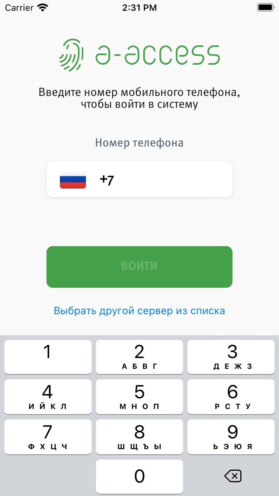
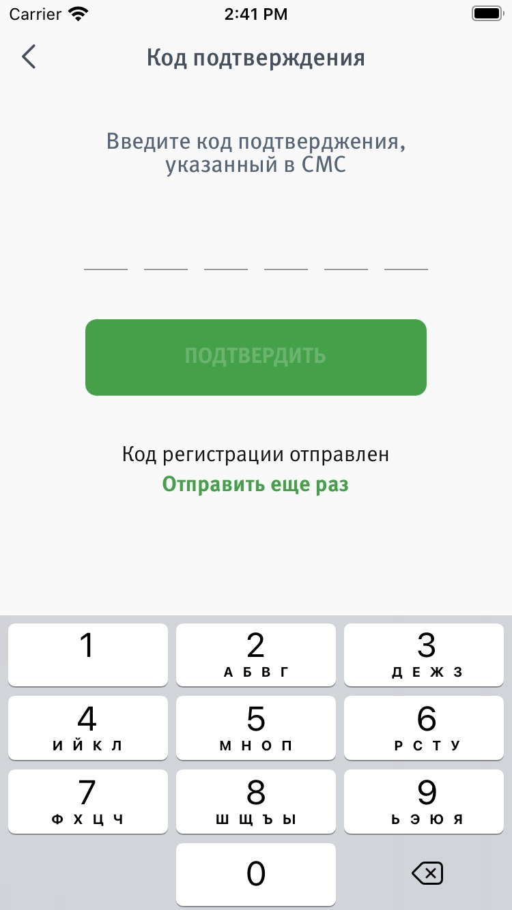

#### 2.1.3 Создание пропусков

**Типы пропусков:**

| Тип | Описание | Ключевые поля |
|-----|----------|---------------|
| На транспорт | Для автомобилей и других ТС | Категория ТС, марка, гос. номер, время прибытия, комментарий |
| На человека | Для посетителя, курьера или рабочего | Категория (Посетитель/Курьер/Рабочий), ФИО, время, комментарий |
| На группу людей | Несколько человек одновременно | Категория, ФИО каждого участника (через +), время, комментарий |
| Регулярный | Повторяющиеся визиты | Дни недели, дата окончания, время для каждого дня |

**Бизнес-правила:**
- Тип пропуска по умолчанию определяет администратор объекта
- Пропуск действует до полуночи текущего дня
- Система проверяет время с точностью до минуты
- Регулярный пропуск автоматически аннулируется через 6 месяцев
- Гос. номер вводится кириллицей или латиницей — система стандартизирует
- Для иностранных/специальных номеров: режим «Иностранный/специальный номер» + первые 4 символа
- При использовании PIN-кода — он отображается после создания пропуска

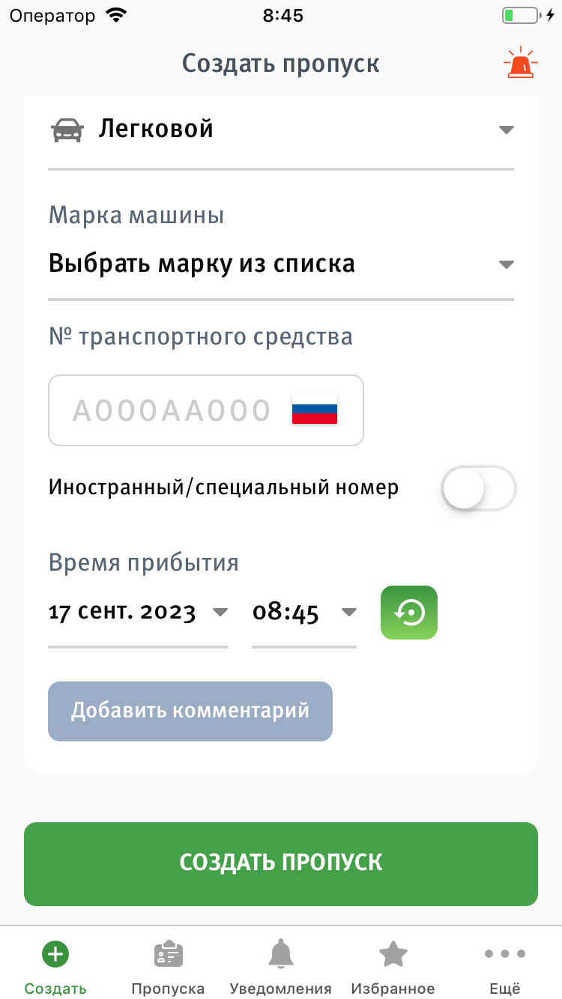
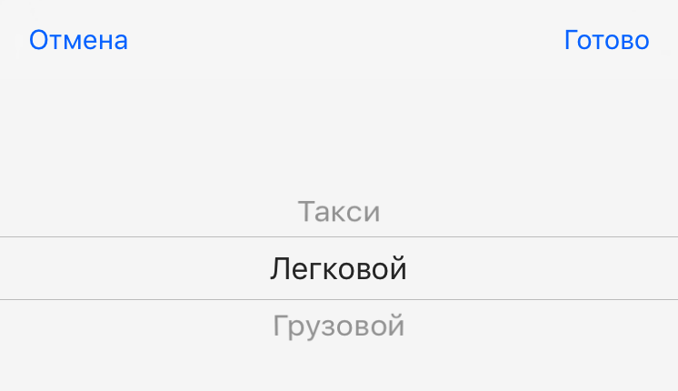
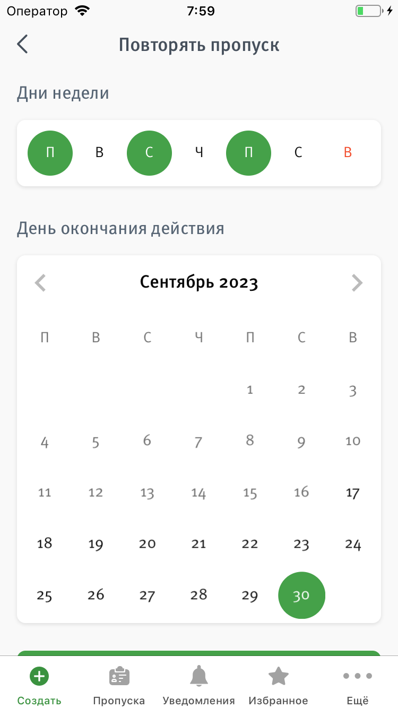

#### 2.1.4 Управление пропусками

- **Шаринг** — отправка ссылки на пропуск через мессенджеры/email/SMS (ссылка содержит: адрес, время действия, детали)
- **Повтор** — создание нового пропуска на основе существующего (удобно для частых посетителей)
- **Избранное** — сохранение важных пропусков
- **PUSH-уведомления** — о статусе пропуска и прибытии гостя
- **Оффлайн-режим (iOS)** — создание пропусков без интернета, синхронизация при подключении

#### 2.1.5 Модули приложения

Подключаются индивидуально для каждого объекта. Доступ: нижнее меню -> «Ещё» -> выбор модуля.

| Модуль | Описание |
|--------|----------|
| **Пользователи** | Просмотр персон, связанных с помещением. Собственники могут добавлять новых пользователей самостоятельно |
| **Показания счетчиков** | Передача и просмотр показаний счётчиков, история за предыдущие периоды |
| **RFID-метки** | Блокировка/разблокировка RFID-меток, просмотр журнала использования |
| **Камеры** | Просмотр событий от камер (связанных с авто/пропусками), фотофиксация |

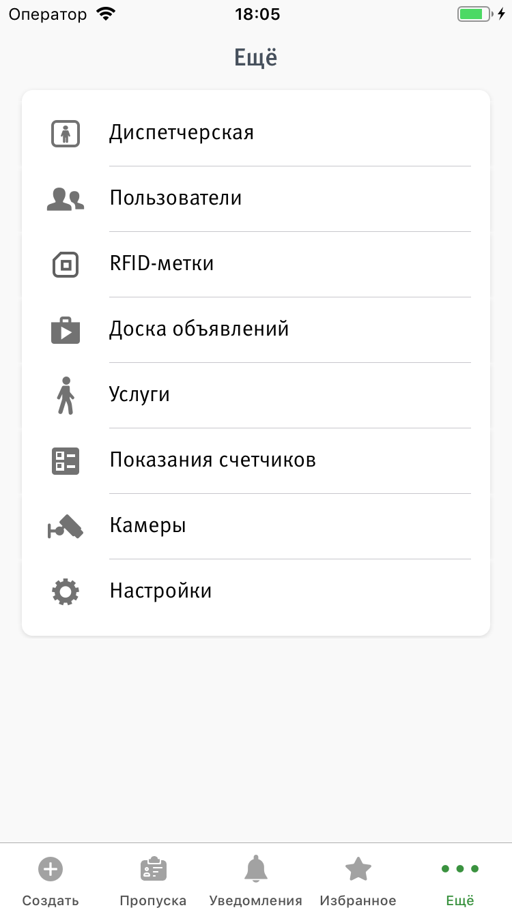

#### 2.1.6 Управление личным транспортом

- Собственник помещения добавляет/удаляет ГРЗ в пределах установленного лимита
- Поля: Марка, Цвет, Номер (кириллица/латиница — автостандартизация)
- Путь: Ещё -> Пользователи -> Добавить транспорт
- Кнопка доступна только для профиля «Собственник»
- Номера без ограничений по количеству проездов и сроку действия

#### 2.1.7 PIN-коды

Для объектов с PIN-pad устройствами:
- PIN-код (4 цифры) генерируется после создания пропуска
- Передача: устно, через «Шаринг» или в комментариях заказа
- Ввод на PIN-pad: зелёный индикатор + звуковой сигнал при успехе
- При ошибке: ожидание 5 секунд или клавиша # для сброса
- PUSH-уведомление при прибытии гостя

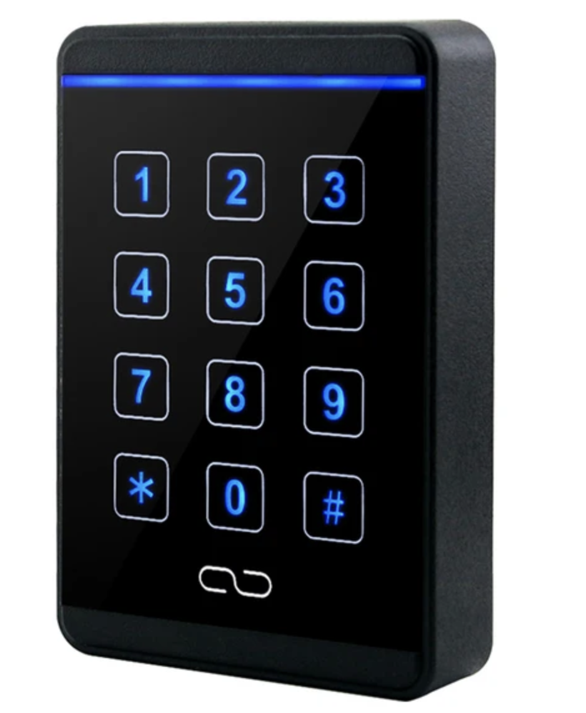

---

### 2.2 Веб-кабинет пользователя

- Вход на a-access.ru -> «Войти» -> «Для пользователей»
- Авторизация: номер телефона + пароль
- Первый вход: восстановление пароля -> SMS-код -> создание пароля
- Телефон должен быть предварительно добавлен администратором

---

### 2.3 Веб-кабинет администратора

#### 2.3.1 Управление персонами

- Раздел «Персоны»: добавление, редактирование, блокировка пользователей
- **Добавление:** кнопка «Добавить» -> заполнение формы -> «Сохранить»
- **Поле «Блокировать после»:** автоматическая блокировка через заданный период
- **Блокировка:** запрещает создание пропусков и отключает все идентификаторы (ГРЗ и RFID)
- При добавлении указываются доступные группы

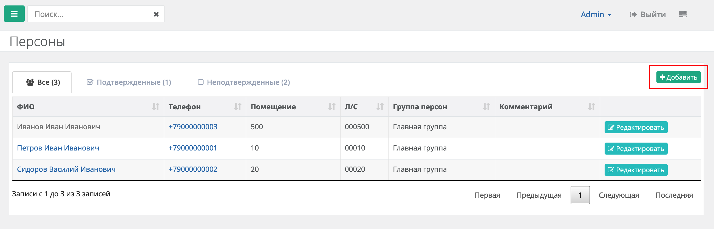
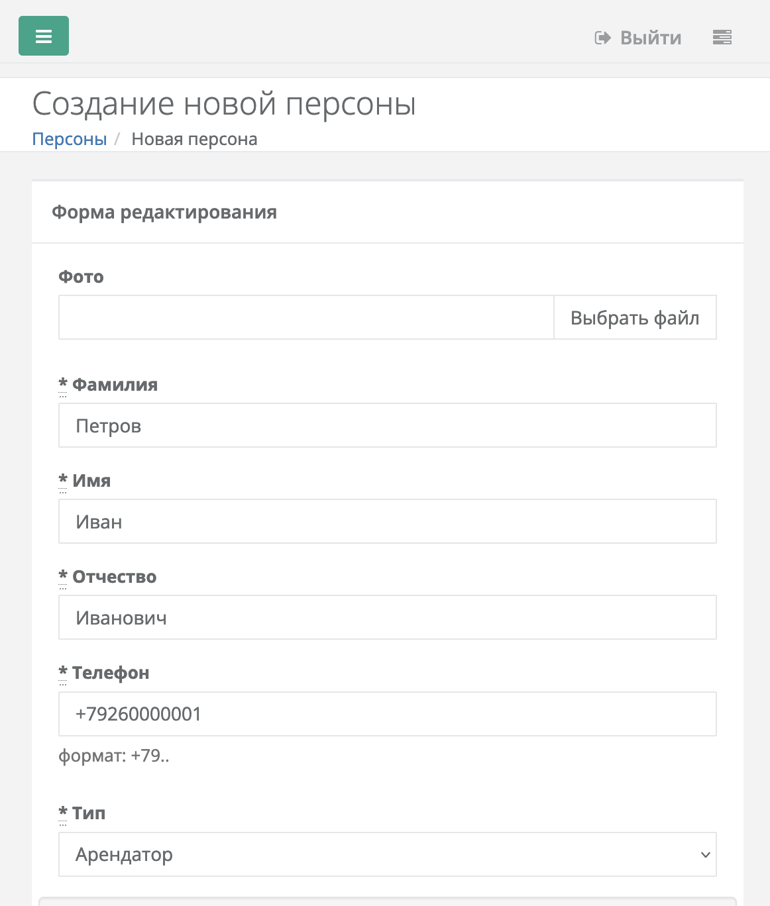

#### 2.3.2 Группы персон

- Разделение персон по группам для изоляции пропусков между группами
- Пропуска из одной группы не пересекаются с другой

#### 2.3.3 Добавление транспорта (администратором)

- В профиле персоны: нажать (+) для добавления ГРЗ
- Номер кириллицей или латиницей -> автоматическая стандартизация
- Опция «Иностранный номер» для нестандартных ГРЗ
- ГРЗ без ограничений по количеству проездов и сроку действия
- Используется для ANPR-камер (автоматический проезд)

#### 2.3.4 RFID-метки

- Привязка в разделе «Персоны»
- **Поле TID:** считывается RFID-считывателем или вводится вручную с карточки/брелока
- **Поле «Описание»:** видно операторам при просмотре событий

#### 2.3.5 Уведомления (PUSH)

- Поля: тема, текст, получатели (персоны/группы/списки)
- Опции: ссылка на внешний сайт, прикрепление файла
- **Флаг «Закрепить»** — отображение уведомления новым пользователям
- Поддержка эмодзи в теме и тексте

#### 2.3.6 Списки рассылки и шаблоны уведомлений

- Именованные списки персон для регулярных рассылок
- Шаблоны уведомлений: сохранение + повторное использование

#### 2.3.7 Постоянный пропуск

- В форме создания пропуска -> «Дополнительные параметры» -> Статус: «Постоянный»
- Отображается на экране пропусков до истечения срока действия

#### 2.3.8 Чёрный список

- Добавление ГРЗ транспортного средства с указанием срока нахождения в ЧС
- По истечении срока — ТС снова может заезжать
- Красная подсветка строк с истёкшим сроком

#### 2.3.9 Отчёты

| Тип отчёта | Описание | Формат |
|------------|----------|--------|
| **По нарушениям доступа** | Машины без пропусков, превышение скорости. Период + дашборд с графиком | XLS |
| **Универсальный** | Гибкая выгрузка по пропускам. Поиск по нескольким образцам, (*) для всех записей | XLS |
| **Периодический** | Автоматическая выгрузка (ежедневно/еженедельно/ежемесячно) на email | XLS на email |

**Расписание периодических отчётов:**
- Ежедневно — на следующий день
- Еженедельно — по понедельникам
- Ежемесячно — 1-го числа

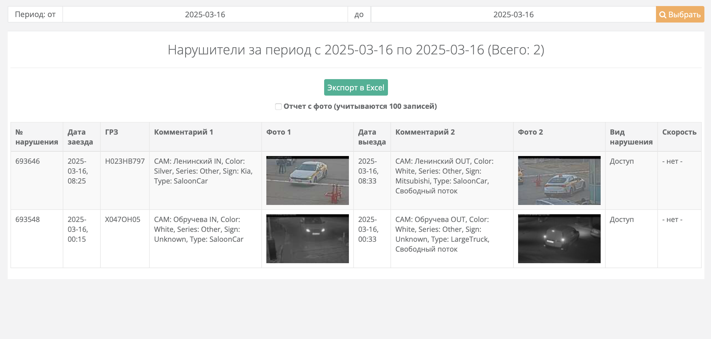
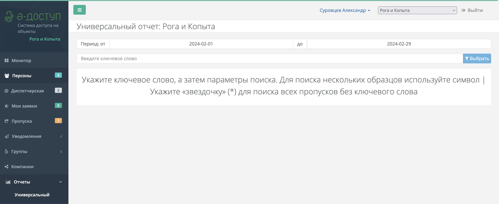

#### 2.3.10 Управление паролями пользователей

- Генерация пароля или ввод вручную
- Опция «Отправлять данные для входа на почту» (по умолчанию вкл.)

---

### 2.4 Веб-кабинет оператора

- Тот же вход, что и у администратора: a-access.ru -> «Войти» -> «Для администратора»
- Учётные данные предоставляет администратор объекта

**Статусы пропусков:**

| Статус | Описание |
|--------|----------|
| Новый | Только что создан |
| Подтверждён | Одобрен администратором/оператором |
| На объекте | ТС/человек находится на территории |
| Завершён | Визит завершён |
| Отменён | Пропуск аннулирован |
| Просрочен | Время действия истекло |
| Постоянный | Действует до указанного срока |

**Функции оператора:**
1. **Смена статуса** — нажать строку -> выбрать статус -> подтвердить
2. **Поиск по автомобилям** — проверка принадлежности авто и статуса в ЧС
3. **Создание пропуска вручную** — кнопка -> заполнение формы -> создать
4. **Просмотр событий** — данные от камер и RFID-считывателей в реальном времени

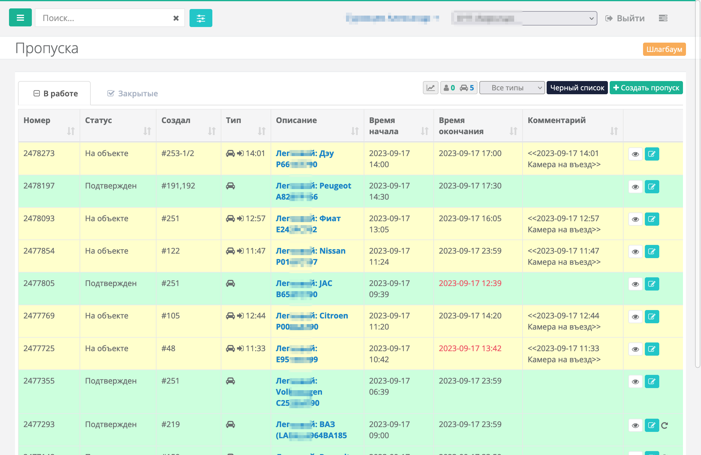
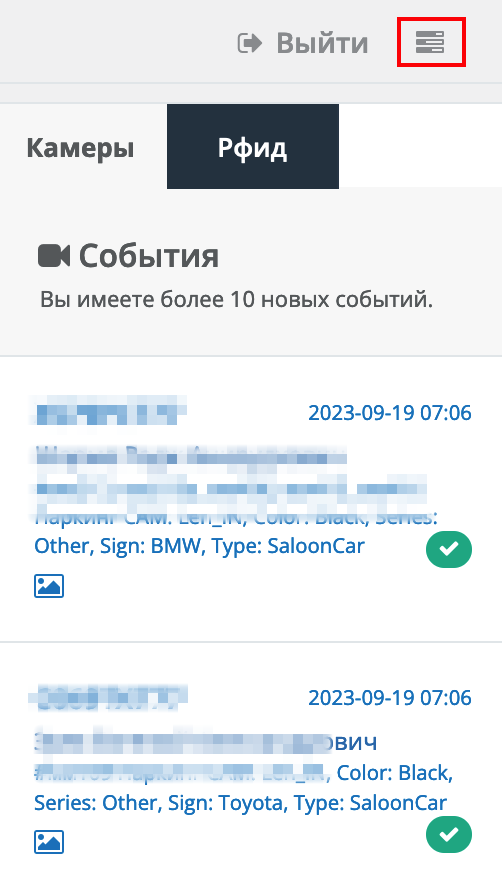

---

### 2.5 Оплата

- **Платёжные системы:** МИР, VISA, MasterCard
- **Безопасность:** TLS, данные карт на сервере платёжной системы, сайт не хранит данные
- **Эквайринг:** АО «Райффайзенбанк»

---

## 3. Перечень задач, которые решает система

### 3.1 Для резидентов

| # | Задача | Как решается |
|---|--------|-------------|
| 1 | Создание разовых пропусков для гостей | Мобильное приложение: выбор типа -> заполнение формы -> пропуск действует до полуночи |
| 2 | Создание регулярных пропусков | Режим «Повтор»: дни недели + дата окончания (макс. 6 мес.) |
| 3 | Уведомление гостя о пропуске | Функция «Шаринг»: ссылка через мессенджер/email/SMS |
| 4 | Повторное приглашение частого гостя | Кнопка «Повтор» на существующем пропуске |
| 5 | Управление личным транспортом | Добавление/удаление ГРЗ в рамках лимита (для ANPR-проезда) |
| 6 | Контроль RFID-меток | Блокировка/разблокировка + журнал использования |
| 7 | Передача показаний счётчиков | Модуль «Показания счётчиков» с историей |
| 8 | Просмотр событий камер | Модуль «Камеры» с фотофиксацией |
| 9 | Работа без интернета (iOS) | Оффлайн-режим с синхронизацией при подключении |
| 10 | Доступ по PIN-коду | 4-значный PIN, вводится на PIN-pad |

### 3.2 Для администраторов

| # | Задача | Как решается |
|---|--------|-------------|
| 11 | Управление жителями/сотрудниками | Веб-кабинет: CRUD персон, автоблокировка по дате, изоляция по группам |
| 12 | Группировка пользователей | Группы персон — пропуска не пересекаются между группами |
| 13 | Добавление транспорта жителям | Профиль персоны: ГРЗ (кириллица/латиница), иностранные номера |
| 14 | Привязка RFID-меток | Поле TID (считыватель или ввод с карточки) |
| 15 | Массовые уведомления | PUSH: персонально / по группам / по спискам рассылки |
| 16 | Шаблоны уведомлений | Сохранение шаблонов для регулярных рассылок |
| 17 | Создание постоянных пропусков | Доп. параметры -> Статус: «Постоянный» |
| 18 | Чёрный список ТС | ГРЗ + срок, автоматическое снятие |
| 19 | Аналитика и отчётность | 3 типа отчётов в XLS |
| 20 | Управление учётными записями | Генерация/смена паролей, отправка на email |

### 3.3 Для операторов

| # | Задача | Как решается |
|---|--------|-------------|
| 22 | Контроль въезда/выезда | Экран «Пропуска» с 7 статусами, смена статуса в 3 клика |
| 23 | Проверка автомобиля | Поиск по ГРЗ: принадлежность + статус в ЧС |
| 24 | Ручное создание пропусков | Форма создания из оператор-панели |
| 25 | Мониторинг событий | Данные от камер и RFID в реальном времени |

---

## 4. Интеграции с оборудованием

| Тип оборудования | Функция | Протокол/Интеграция |
|---|---|---|
| ANPR-камеры | Распознавание гос. номеров, автоматический проезд | Облачная интеграция |
| RFID-считыватели | Идентификация по меткам (карточки, брелоки) | TID-идентификатор |
| PIN-pad устройства | Ввод 4-значного PIN-кода для прохода | Аппаратный интерфейс |
| Настольные RFID-считыватели | Считывание TID для привязки к персоне | USB/HID |

---

## 5. Ключевые бизнес-правила (сводка)

1. **Одно устройство** — авторизация сбрасывается при входе с другого
2. **Пропуск до полуночи** — разовый пропуск действует до 00:00 текущего дня
3. **Регулярный пропуск макс. 6 мес.** — автоматическое аннулирование
4. **ГРЗ автостандартизация** — кириллица <-> латиница, единый формат
5. **Блокировка персоны** — запрещает ВСЁ: пропуска, ГРЗ, RFID
6. **Группы изолируют пропуска** — пропуска разных групп не пересекаются
7. **Чёрный список временный** — указывается срок, по истечении ТС снова может заезжать
8. **Собственник управляет транспортом** — в пределах лимита, без обращения к администратору
9. **PIN-код 4 цифры** — генерируется системой при создании пропуска
10. **Закреплённые уведомления** — показываются новым пользователям при первом входе

---

## 6. Юридическая информация и контакты

| Поле | Значение |
|------|----------|
| Юрлицо | ООО «А-Доступ» |
| ИНН | 7728494767 |
| ОГРН | 1197746737880 |
| КПП | 772801001 |
| Адрес | 119421, Москва, Ленинский пр-т, 111 к.1, кв. 125а |
| Email | we@a-access.ru |
| Телефон | +7 (977) 371-77-02 |
| Эквайринг | АО «Райффайзенбанк» |
| Безопасность платежей | PCI DSS, 3-D Secure, TLS, данные карт не хранятся на сайте |

### Документы для скачивания (с сайта)

1. Заявка на подключение к системе А-ДОСТУП
2. Инструкция по работе с настольным считывателем
3. Инструкция по работе с метками для жителей
4. Инструкция по работе с пластиковыми картами

---

## 7. Журнал изменений A-Access (для справки)

| Дата | Версия | Изменения |
|------|--------|-----------|
| 28.02.2024 | Android v1.7.2 | Автоподгрузка марок авто, пересоздание без «Избранного», шаринг пропусков |
| 05.12.2023 | Android v1.7.0 | Китайские марки, динамические категории, улучшение модуля «Камеры», настраиваемая длина ГРЗ |
| 04.12.2023 | iOS v1.7.3 | Оффлайн-режим, китайские марки, динамические категории, исправление времени пропуска |

---

## Связанные материалы

- [Simplegate](./Simplegate.md) — другой конкурент в сегменте облачных СКУД
- [VisitorControl](./VisitorControl.md) — конкурент в enterprise-сегменте
- [Исследование рынка систем контроля доступа и маркетинг](../Исследование%20рынка%20систем%20контроля%20доступа%20и%20маркетинг.md)

---

## История изменений

| Версия | Дата | Автор | Изменения |
|--------|------|-------|-----------|
| 1.0 | 2026-03-05 | AI-агент | Первоначальная версия на основе анализа docs.a-access.ru |
