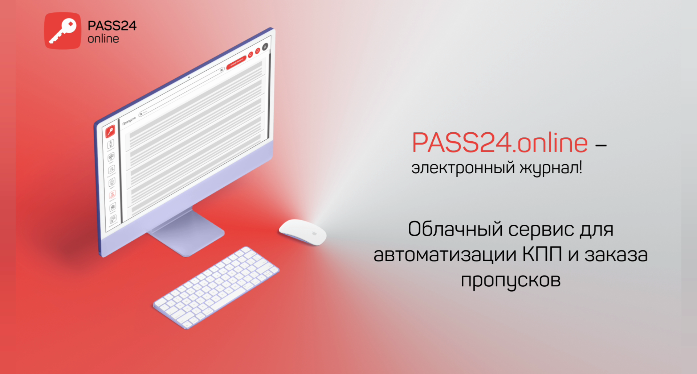
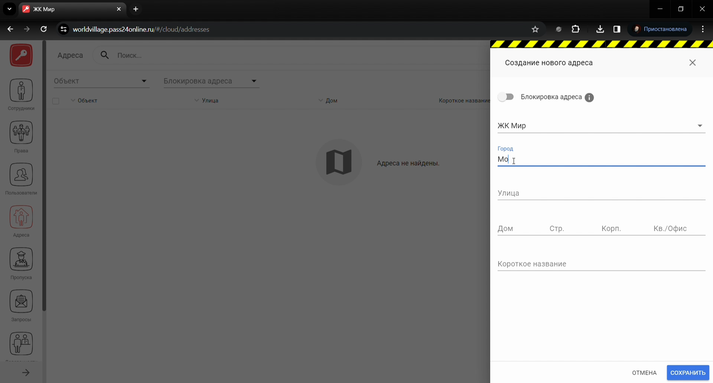
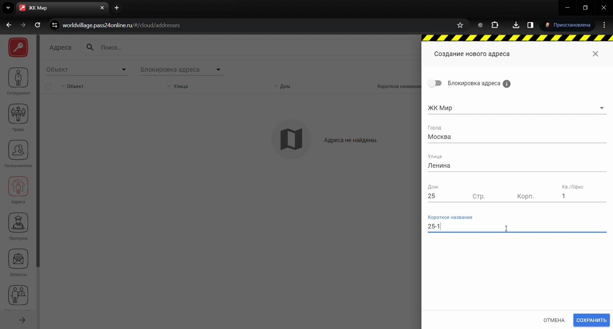
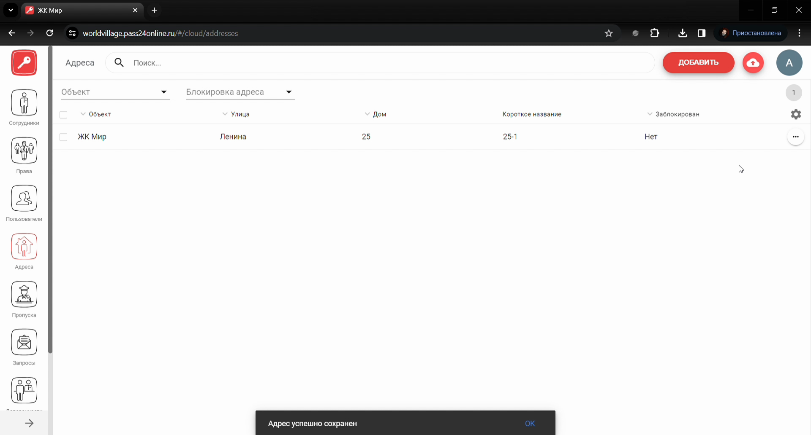
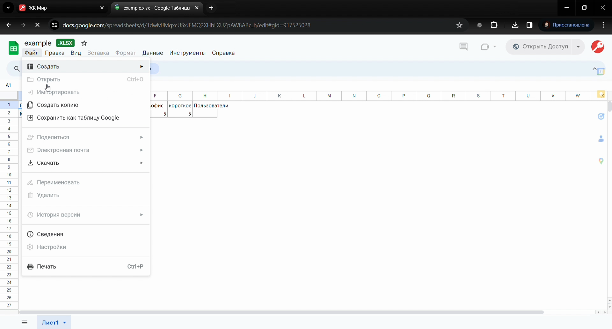
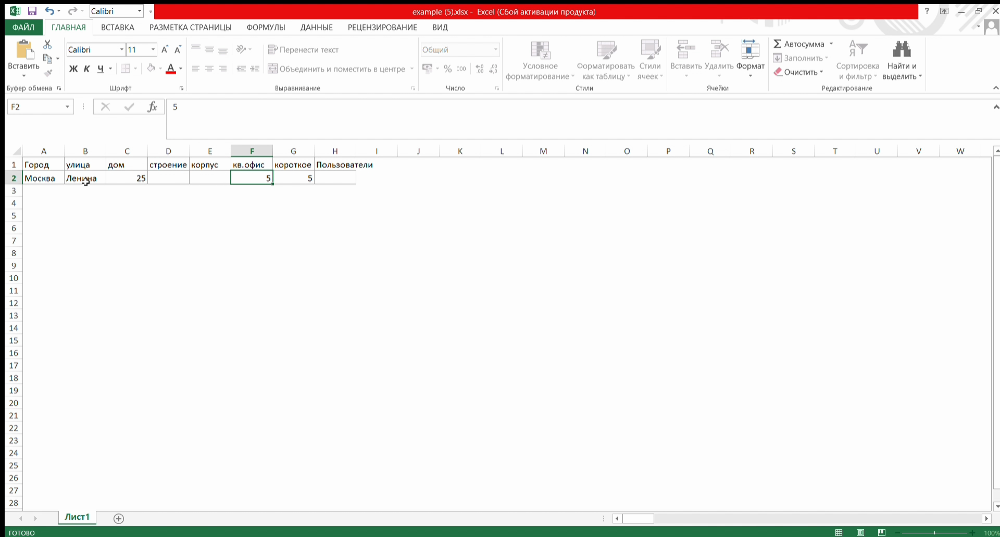
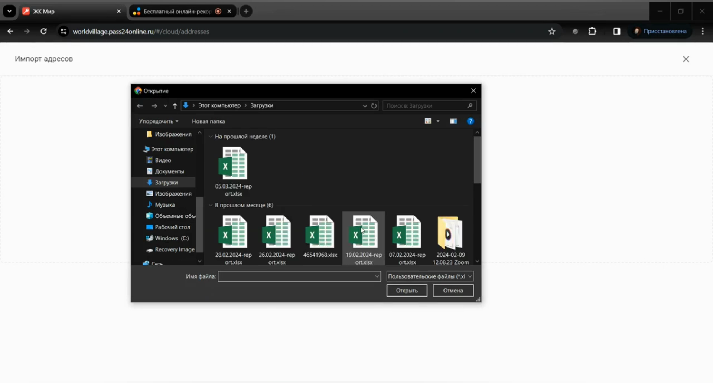
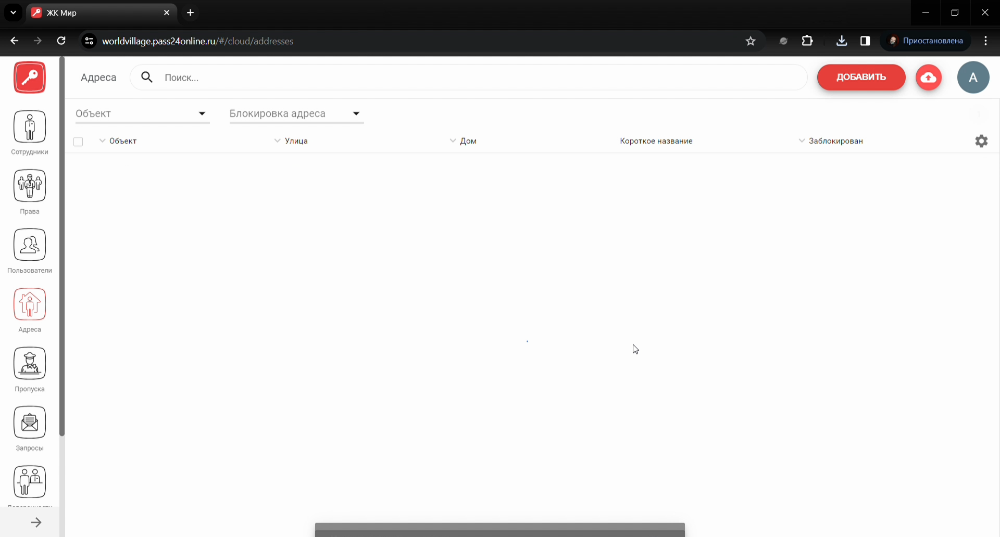
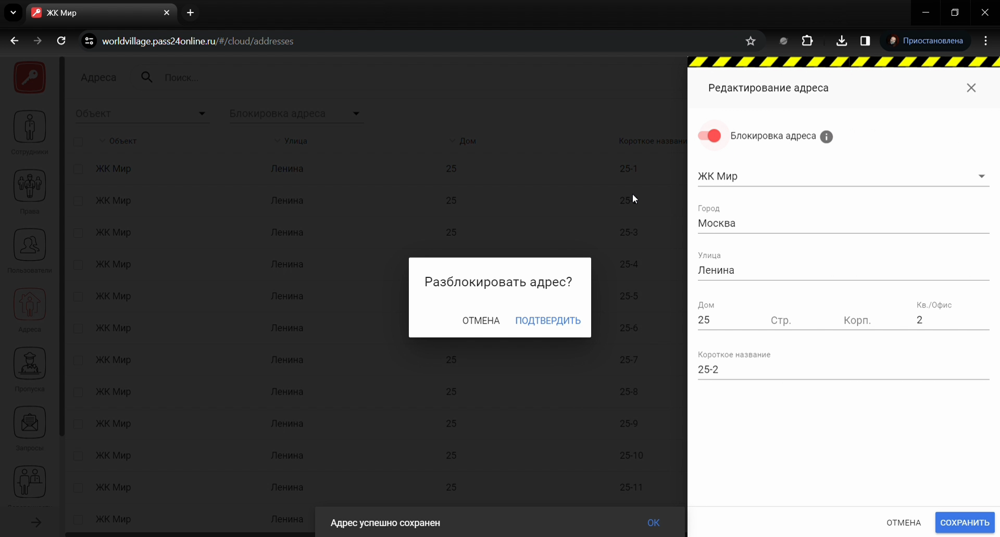

# Модуль Адреса

## Метаданные документа

| Параметр | Значение |
|----------|----------|
| **Версия** | 1.0 |
| **Дата создания** | 2026-01-22 |
| **Дата последнего обновления** | 2026-01-22 |
| **Автор** | Система автоматической конвертации |
| **Ответственный за актуальность** | Отдел технической поддержки |
| **Статус** | Актуально |
| **Тип документа** | Обучение |
| **Отдел** | Тех. поддержка |
| **Теги** | адреса, веб-интерфейс, PASS24.online, импорт, инструкция |

---

## Целевая аудитория

**Для кого:** Специалисты техподдержки, новые сотрудники, администраторы веб-интерфейса PASS24.online

**Уровень подготовки:** Начинающий

**Когда использовать:** При обучении работе с модулем «Адреса» в веб-интерфейсе PASS24.online: добавление, импорт, редактирование, блокировка и удаление адресов

---

## Краткое описание

Данная инструкция описывает работу с модулем **Адреса** в веб-интерфейсе PASS24.online. В документе приведены пошаговые действия: добавление одного адреса, импорт адресов из файла, редактирование, блокировка и разблокировка, удаление одного или нескольких адресов. Учтены требования к формату файла импорта и предпросмотру данных.

---

## Пошаговая инструкция

### Шаг 1: Переход в модуль «Адреса»

**Что делать:**
1. В **боковом меню** перейдите во **вкладку «Адреса»**

**Где:** Веб-интерфейс PASS24.online, боковое меню

**Результат:** Открыт раздел «Адреса»

---

### Шаг 2: Добавление одного адреса

**Что делать:**
1. В **правом верхнем углу** нажмите **«Добавить»**
2. Выберите **объект**
3. Введите **данные адреса** и **короткое название** для удобства поиска
4. Нажмите **«Сохранить»**

**Где:** Раздел «Адреса», форма добавления

**Результат:** Адрес добавлен

---

### Шаг 3: Импорт адресов

**Что делать:**
1. В **правом верхнем углу** нажмите **«Импорт»**
2. В открывшемся окне доступен **образец импорта** — файл должен соответствовать этому образцу
3. Скачайте образец, заполните его **в соответствии с образцом**
4. Выберите **объект** и загрузите файл с адресами
5. После загрузки в окне импорта станет доступен **предпросмотр** импортируемых данных
6. Если всё загружено верно, нажмите **«Отправить»** и подтвердите отправку

**Где:** Раздел «Адреса», кнопка «Импорт»

**Результат:** Адреса импортированы

---

### Шаг 4: Редактирование адреса

**Что делать:**
1. Нажмите **три точки** справа от адреса
2. Выберите **«Редактировать»**
3. Внесите необходимые изменения
4. Нажмите **«Сохранить»**

**Где:** Раздел «Адреса», список адресов

**Результат:** Изменения сохранены

---

### Шаг 5: Блокировка и разблокировка адреса

**Что делать:**
1. Нажмите **три точки** справа от адреса
2. Выберите **«Редактировать»**
3. Нажмите **«Блокировать адрес»**, подтвердите блокировку
4. Нажмите **«Сохранить»**
5. Для разблокировки выполните те же шаги и снимите блокировку

**Где:** Раздел «Адреса», карточка адреса

**Результат:** Адрес заблокирован или разблокирован

---

### Шаг 6: Удаление адресов

**Удаление одного адреса:**
1. Нажмите **три точки** справа от адреса
2. Выберите **«Удалить»**
3. Подтвердите удаление

**Удаление нескольких адресов:**
1. Слева **отметьте чекбоксами** нужные адреса
2. В **правом верхнем углу** нажмите **корзинку**
3. Подтвердите удаление

**Где:** Раздел «Адреса», список адресов

**Результат:** Адрес(а) удалены

---

## Контрольный чек-лист

- [ ] Выполнен переход во вкладку «Адреса» в боковом меню
- [ ] При добавлении: выбран объект, введены данные и короткое название, нажато «Сохранить»
- [ ] При импорте: использован образец, файл загружен, проверен предпросмотр, выполнена отправка
- [ ] При редактировании: открыта форма, внесены изменения, нажато «Сохранить»
- [ ] При блокировке/разблокировке: подтверждено действие, нажато «Сохранить»
- [ ] При удалении: подтверждено удаление (одного или нескольких адресов)

---

## Типичные ошибки и их решение

| Ошибка | Причина | Решение |
|--------|---------|---------|
| Импорт не проходит | Файл не соответствует образцу | Скачать образец, заполнить строго по нему |
| Нет предпросмотра | Файл не загружен или некорректен | Проверить формат и содержимое файла |
| Не удаётся удалить несколько | Не отмечены чекбоксы | Отметить нужные адреса слева, затем нажать корзинку |

---

## Связанные материалы

- [Модуль Объекты](Модуль%20Объекты.md)
- [Модуль Доверенности](Модуль%20Доверенности.md)
- [Массовая рассылка пешеходного пропуска](../Массовая%20рассылка/Массовая%20рассылка%20пешеходного%20пропуска.md)

---

## История изменений

| Версия | Дата | Автор | Изменения |
|--------|------|-------|-----------|
| 1.0 | 2026-01-22 | Система автоматической конвертации | Первоначальная версия на основе видео, приведена к шаблону базы знаний |

---
