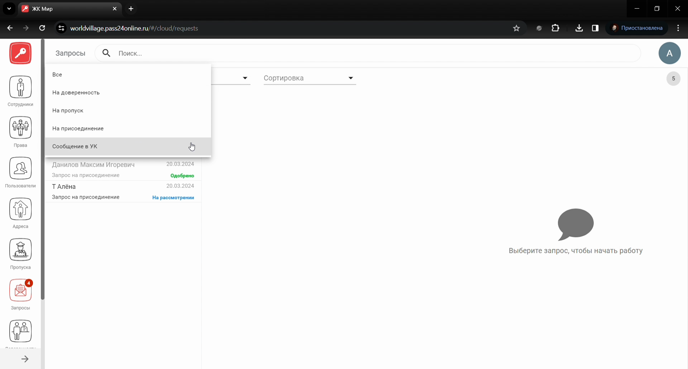
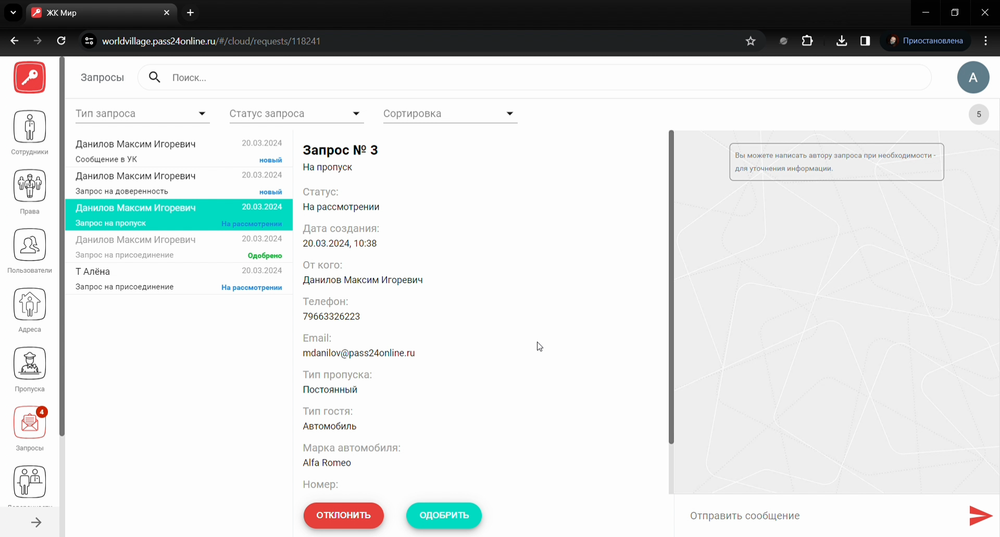
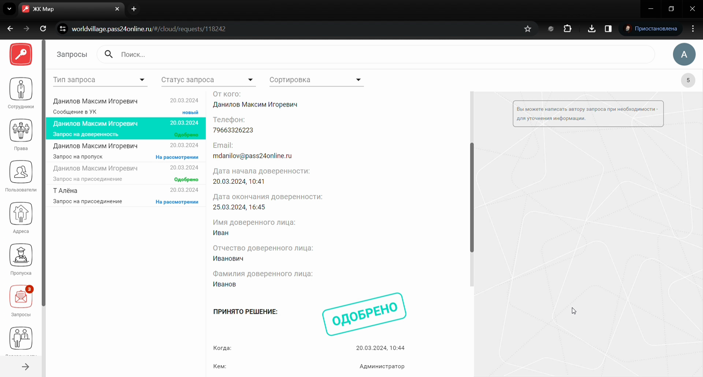
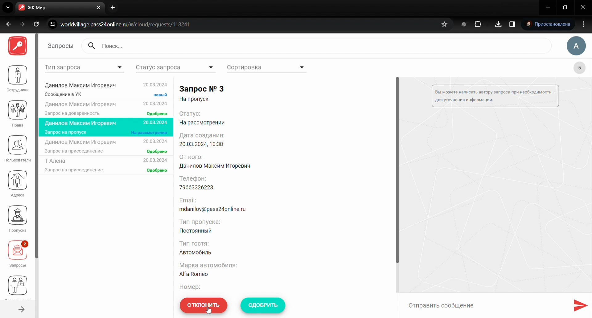

# Модуль Запросы

## Метаданные документа

| Параметр | Значение |
|----------|----------|
| **Версия** | 1.0 |
| **Дата создания** | 2026-01-22 |
| **Дата последнего обновления** | 2026-01-22 |
| **Автор** | Система автоматической конвертации |
| **Ответственный за актуальность** | Отдел технической поддержки |
| **Статус** | Актуально |
| **Тип документа** | Обучение |
| **Отдел** | Тех. поддержка |
| **Теги** | запросы, веб-интерфейс, PASS24.online, одобрение, отклонение, инструкция |

---

## Целевая аудитория

**Для кого:** Специалисты техподдержки, новые сотрудники, администраторы веб-интерфейса PASS24.online

**Уровень подготовки:** Начинающий

**Когда использовать:** При обучении работе с модулем «Запросы» в веб-интерфейсе PASS24.online: одобрение и отклонение входящих запросов от пользователей

---

## Краткое описание

Данная инструкция описывает работу с модулем **Запросы** в веб-интерфейсе PASS24.online. В системе есть **4 вида запросов**: запрос на присоединение, запрос на пропуск, запрос на доверенность и запрос в управляющую компанию. В документе приведены пошаговые действия: одобрение и отклонение запросов, фильтрация и сортировка. Пользователь получает push-уведомление при смене статуса. **Важно:** при отклонении указание причины обязательно.

---

## Пошаговая инструкция

### Шаг 1: Виды запросов и статусы

**Виды запросов:**
- Запрос на присоединение
- Запрос на пропуск
- Запрос на доверенность
- Запрос в управляющую компанию

**Статусы:** При появлении запроса статус — **«Новый»**. При нажатии на запрос — **«Рассмотрение»**. После решения — **«Одобрен»** или **«Отклонён»**. Пользователь получает **push-уведомление** при смене статуса.

---

### Шаг 2: Одобрение запроса

**Что делать:**
1. Перейдите во **вкладку «Запросы»**
2. Нажмите на **входящий запрос**
3. Откроется **карточка запроса** — нажмите кнопку **«Одобрить»**
4. **Запрос на пропуск, доверенность или в УК:** подтвердите одобрение
5. **Запрос на присоединение:** добавьте **адрес**, затем подтвердите одобрение

**Где:** Веб-интерфейс PASS24.online, раздел «Запросы»

**Результат:** Запрос одобрен, пользователь получит уведомление

---

### Шаг 3: Отклонение запроса

**Что делать:**
1. В **карточке запроса** нажмите кнопку **«Отклонить»**
2. **Укажите причину отклонения** (обязательно)
3. Подтвердите отклонение

**Где:** Карточка запроса справа

**Результат:** Запрос отклонён, пользователь получит уведомление

**Важно:** Указание **причины отклонения** обязательно.

---

### Шаг 4: Фильтрация и сортировка

**Что делать:**
1. **Фильтруйте** запросы по **типу** и **статусу**
2. **Сортируйте** запросы: **«Сначала новые»** или **«Сначала не обработанные»**

**Где:** Раздел «Запросы», панель фильтров и сортировки

**Результат:** Удобный поиск нужных запросов

---

## Контрольный чек-лист

- [ ] Выполнен переход во вкладку «Запросы»
- [ ] При одобрении: нажат «Одобрить», при запросе на присоединение добавлен адрес, подтверждено одобрение
- [ ] При отклонении: указана причина отклонения, подтверждено отклонение
- [ ] При необходимости использованы фильтры и сортировка

---

## Типичные ошибки и их решение

| Ошибка | Причина | Решение |
|--------|---------|---------|
| Нельзя отклонить | Не указана причина | Обязательно указать причину отклонения |
| Не нахожу запрос | Нет фильтра/сортировки | Использовать фильтр по типу/статусу или сортировку |
| Пользователь не получил уведомление | Отключены уведомления | Проверить настройки уведомлений у пользователя |

---

## Связанные материалы

- [Модуль Доверенности](Модуль%20Доверенности.md)
- [Модуль Пропуска](Модуль%20Пропуска.md)
- [Модуль Адреса](Модуль%20Адреса.md)
- [Создание Доверенности](../Создание%20Доверенности.md)

---

## История изменений

| Версия | Дата | Автор | Изменения |
|--------|------|-------|-----------|
| 1.0 | 2026-01-22 | Система автоматической конвертации | Первоначальная версия на основе видео, приведена к шаблону базы знаний |

---
