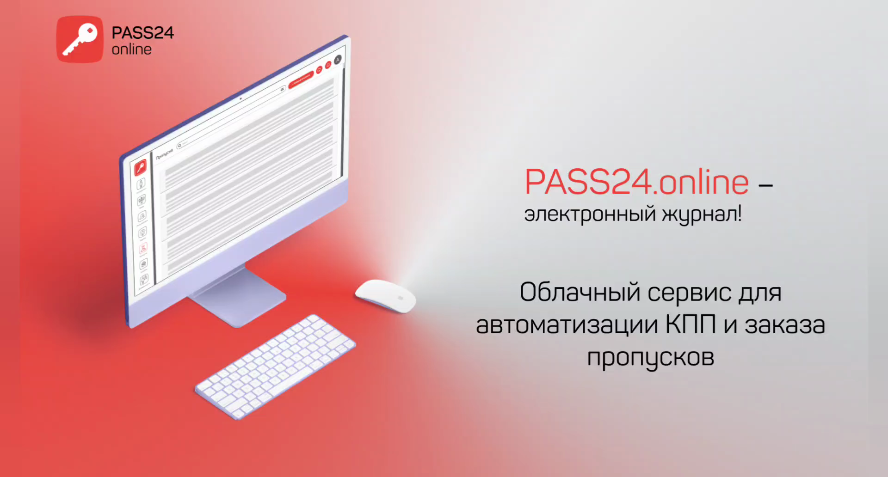
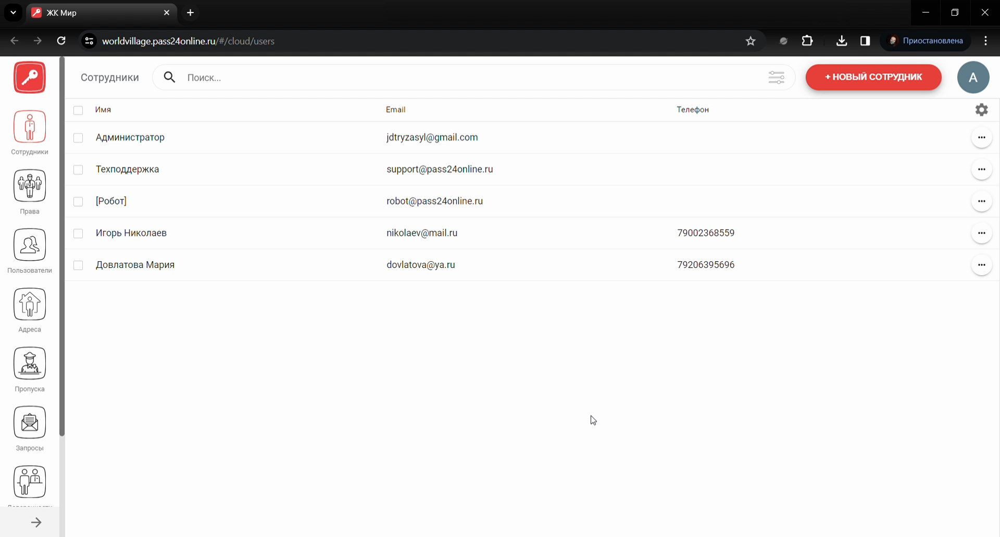
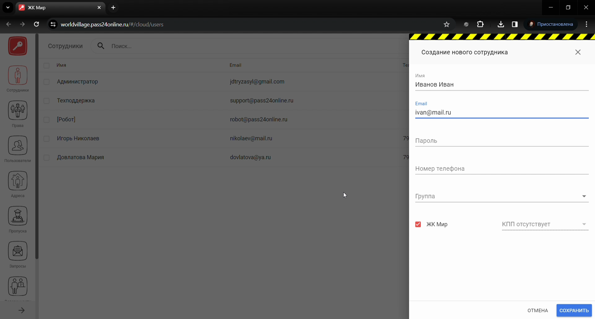
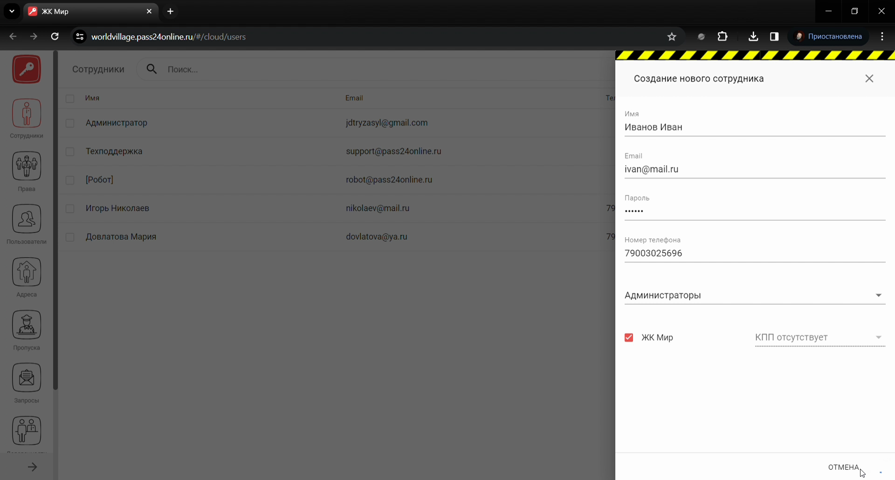
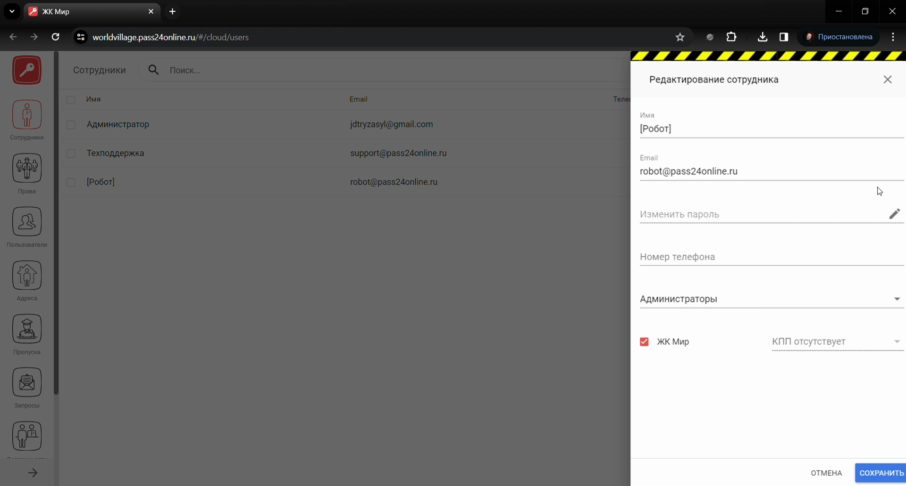

# Модуль Сотрудники

## Метаданные документа

| Параметр | Значение |
|----------|----------|
| **Версия** | 1.0 |
| **Дата создания** | 2026-01-22 |
| **Дата последнего обновления** | 2026-01-22 |
| **Автор** | Система автоматической конвертации |
| **Ответственный за актуальность** | Отдел технической поддержки |
| **Статус** | Актуально |
| **Тип документа** | Обучение |
| **Отдел** | Тех. поддержка |
| **Теги** | сотрудники, веб-интерфейс, PASS24.online, права доступа, инструкция |

---

## Целевая аудитория

**Для кого:** Специалисты техподдержки, новые сотрудники, администраторы веб-интерфейса PASS24.online

**Уровень подготовки:** Начинающий

**Когда использовать:** При обучении работе с модулем «Сотрудники» в веб-интерфейсе PASS24.online: добавление, удаление, редактирование сотрудников и управление их правами доступа

---

## Краткое описание

Данная инструкция описывает работу с модулем **Сотрудники** в веб-интерфейсе PASS24.online. В документе приведены пошаговые действия: добавление нового сотрудника (имя, email, телефон, пароль, группа прав, объект), удаление одного или нескольких сотрудников, редактирование данных и прав доступа.

---

## Пошаговая инструкция

### Шаг 1: Добавление сотрудника

**Что делать:**
1. В **боковом меню** перейдите во **вкладку «Сотрудники»**
2. В **правом верхнем углу** нажмите **«+ Новый сотрудник»**
3. Введите **имя**, **email** и **телефон** сотрудника
4. Задайте **пароль** для входа
5. Выберите **группу прав** и **объект**
6. Нажмите **«Сохранить»**

**Где:** Веб-интерфейс PASS24.online, раздел «Сотрудники»

**Результат:** Сотрудник добавлен

---

### Шаг 2: Удаление сотрудника

**Что делать:**
1. Нажмите **три точки** справа от сотрудника
2. Выберите **«Удалить»**
3. Подтвердите удаление

**Где:** Раздел «Сотрудники», список сотрудников

**Результат:** Сотрудник удалён

---

### Шаг 3: Массовое удаление сотрудников

**Что делать:**
1. Слева **отметьте чекбоксами** нужных сотрудников
2. В **правом верхнем углу** нажмите **корзинку**
3. Подтвердите удаление

**Где:** Раздел «Сотрудники», список сотрудников

**Результат:** Выбранные сотрудники удалены

---

### Шаг 4: Редактирование сотрудника и прав доступа

**Что делать:**
1. Нажмите **три точки** справа от сотрудника
2. Выберите **«Редактировать»** (данные) или **«Редактировать права»** (права доступа)
3. Внесите необходимые изменения
4. Нажмите **«Сохранить»**

**Где:** Раздел «Сотрудники», карточка сотрудника

**Результат:** Данные или права обновлены

---

## Контрольный чек-лист

- [ ] Выполнен переход во вкладку «Сотрудники»
- [ ] При добавлении: введены имя, email, телефон, пароль, выбраны группа прав и объект, нажато «Сохранить»
- [ ] При удалении: подтверждено удаление (одного или нескольких)
- [ ] При редактировании: выбран «Редактировать» или «Редактировать права», внесены изменения, нажато «Сохранить»

---

## Типичные ошибки и их решение

| Ошибка | Причина | Решение |
|--------|---------|---------|
| Сотрудник не входит | Неверный пароль или группа прав | Проверить пароль, при необходимости «Редактировать» и задать новый |
| Удалил не тех сотрудников | Не сняты чекбоксы | Проверить выделение перед нажатием корзинки |
| Нет доступа к разделам | Не настроена группа прав | Использовать «Редактировать права» или [Модуль Права](Модуль%20Права.md) |

---

## Связанные материалы

- [Модуль Права](Модуль%20Права.md)
- [Модуль Пользователи](Модуль%20Пользователи.md)
- [Модуль Объекты](Модуль%20Объекты.md)

---

## История изменений

| Версия | Дата | Автор | Изменения |
|--------|------|-------|-----------|
| 1.0 | 2026-01-22 | Система автоматической конвертации | Первоначальная версия на основе видео, приведена к шаблону базы знаний |

---
