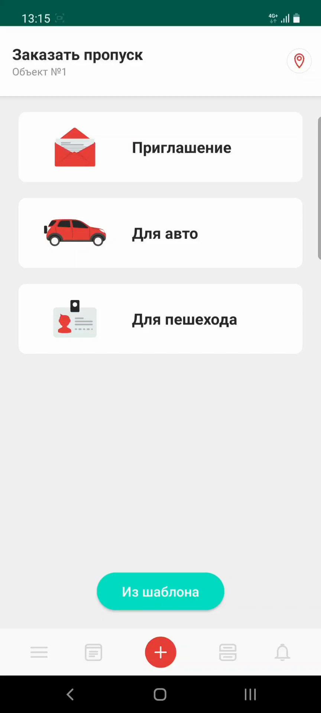
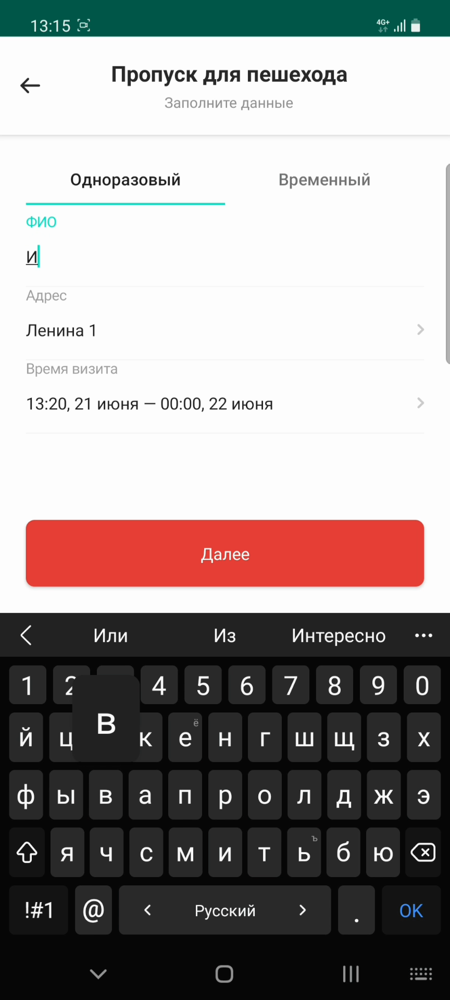
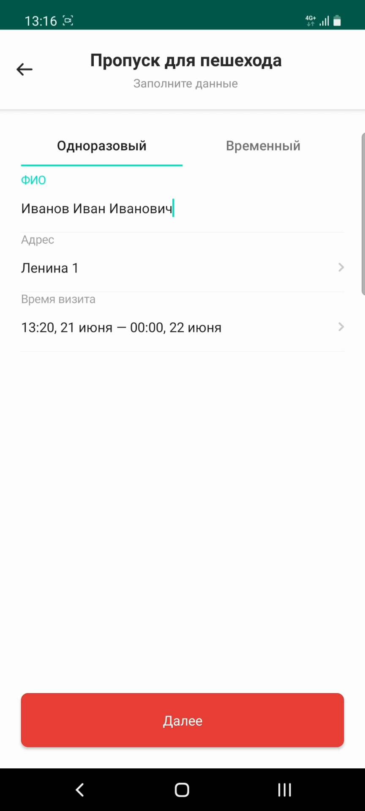
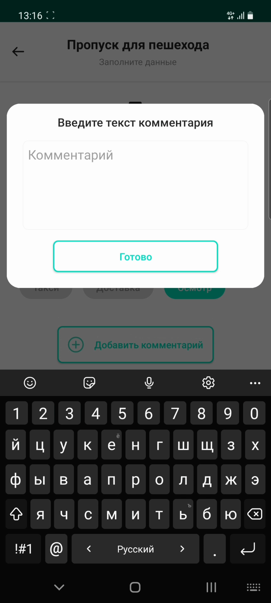

# Создание пропуска для пешехода

## Метаданные документа

| Параметр | Значение |
|----------|----------|
| **Версия** | 1.0 |
| **Дата создания** | 2026-01-22 |
| **Дата последнего обновления** | 2026-01-22 |
| **Автор** | Система автоматической конвертации |
| **Ответственный за актуальность** | Отдел технической поддержки |
| **Статус** | Актуально |
| **Тип документа** | Обучение |
| **Отдел** | Тех. поддержка |
| **Теги** | пропуск, пешеход, мобильное приложение, инструкция |

---

## Целевая аудитория

**Для кого:** Пользователи мобильного приложения PASS24.online, новые сотрудники техподдержки

**Уровень подготовки:** Начинающий

**Когда использовать:** При обучении работе с мобильным приложением PASS24.online, при консультировании пользователей по созданию пешеходных пропусков

---

## Краткое описание

Данная инструкция описывает процесс создания пропуска для пешехода в мобильном приложении PASS24.online. Документ содержит пошаговое руководство от выбора типа пропуска до его успешного создания, включая заполнение данных посетителя, выбор адреса и времени визита.

---

## Пошаговая инструкция

### Шаг 1: Выбор типа пропуска

**Что делать:**
1. Откройте мобильное приложение PASS24.online
2. Нажмите на тип пропуска "Для пешехода"

**Где:** Главный экран приложения, раздел создания пропусков

**Результат:** Открывается форма выбора типа пешеходного пропуска

---

### Шаг 2: Выбор типа визита

**Что делать:**
1. Выберите тип визита: **одноразовый** или **временный**

**Где:** Форма выбора типа пропуска

**Результат:** Выбран тип визита для пропуска

---

### Шаг 3: Ввод данных посетителя

**Что делать:**
1. Введите **фамилию** посетителя
2. Введите **имя** посетителя
3. Введите **отчество** посетителя (при наличии)

**Где:** Форма создания пропуска, поля для ввода ФИО

**Результат:** Данные посетителя заполнены

---

### Шаг 4: Выбор адреса и времени визита

**Что делать:**
1. Выберите **адрес** из списка доступных адресов
2. Укажите **время визита** (дату и время)

**Где:** Форма создания пропуска, поля "Адрес" и "Время визита"

**Результат:** Адрес и время визита указаны

---

### Шаг 5: Переход к дополнительным настройкам

**Что делать:**
1. Нажмите кнопку **"Далее"**

**Где:** Форма создания пропуска, нижняя часть экрана

**Результат:** Открывается экран с дополнительными опциями

---

### Шаг 6: Дополнительные опции (опционально)

**Что делать:**
1. При необходимости укажите одну из доступных **опций**
2. Добавьте **комментарий** к пропуску (если требуется)

**Где:** Экран дополнительных настроек пропуска

**Результат:** Дополнительные настройки заполнены (если были указаны)

---

### Шаг 7: Создание пропуска

**Что делать:**
1. Нажмите кнопку **"Далее"** для завершения создания пропуска

**Где:** Экран дополнительных настроек, нижняя часть экрана

**Результат:** Пропуск успешно создан, отображается подтверждение

---

## Контрольный чек-лист

- [ ] Выбран тип пропуска "Для пешехода"
- [ ] Выбран тип визита (одноразовый или временный)
- [ ] Заполнены все обязательные поля: фамилия, имя, отчество
- [ ] Выбран адрес из списка доступных
- [ ] Указано время визита
- [ ] При необходимости заполнены дополнительные опции и комментарий
- [ ] Пропуск успешно создан и отображается подтверждение

---

## Типичные ошибки и их решение

| Ошибка | Причина | Решение |
|--------|---------|---------|
| Не отображается список адресов | Пользователь не привязан к объекту | Обратиться в управляющую компанию для привязки к объекту |
| Нельзя выбрать время визита | Выбрана прошедшая дата | Выбрать актуальную или будущую дату |
| Пропуск не создается | Не заполнены обязательные поля | Проверить заполнение всех полей, помеченных как обязательные |

---

## Связанные материалы

- [2. Пропуск на автомобиль](2.%20Пропуск%20на%20автомобиль.md)
- [3. Приглашение](3.%20Приглашение.md)
- [6. Мои пропуска](6.%20Мои%20пропуска.md)

---

## История изменений

| Версия | Дата | Автор | Изменения |
|--------|------|-------|-----------|
| 1.0 | 2026-01-22 | Система автоматической конвертации | Первоначальная версия на основе видео |

---
