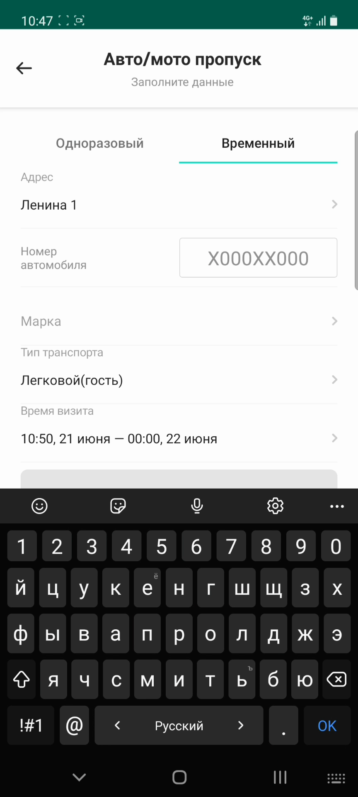
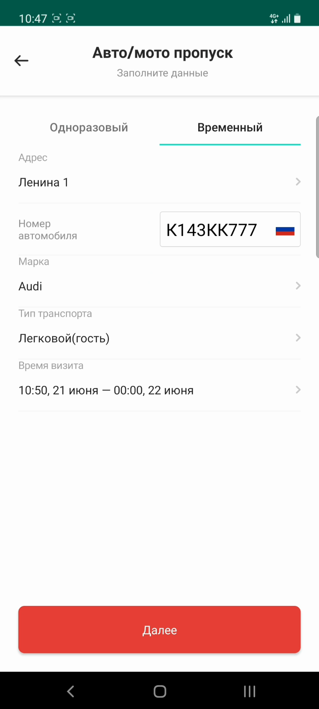
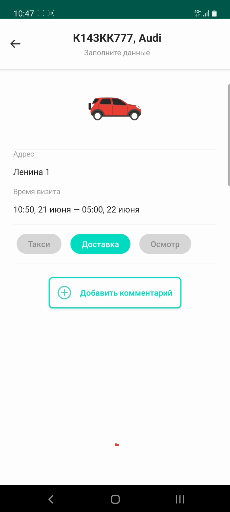

# Создание пропуска на автомобиль

## Метаданные документа

| Параметр | Значение |
|----------|----------|
| **Версия** | 1.0 |
| **Дата создания** | 2026-01-22 |
| **Дата последнего обновления** | 2026-01-22 |
| **Автор** | Система автоматической конвертации |
| **Ответственный за актуальность** | Отдел технической поддержки |
| **Статус** | Актуально |
| **Тип документа** | Обучение |
| **Отдел** | Тех. поддержка |
| **Теги** | пропуск, автомобиль, транспорт, мобильное приложение, инструкция |

---

## Целевая аудитория

**Для кого:** Пользователи мобильного приложения PASS24.online, новые сотрудники техподдержки

**Уровень подготовки:** Начинающий

**Когда использовать:** При обучении работе с мобильным приложением PASS24.online, при консультировании пользователей по созданию автомобильных пропусков

---

## Краткое описание

Данная инструкция описывает процесс создания пропуска на автомобиль в мобильном приложении PASS24.online. Документ содержит пошаговое руководство от выбора типа пропуска до его успешного создания, включая ввод данных об автомобиле (номер, марка), выбор типа транспорта и времени визита.

---

## Пошаговая инструкция

### Шаг 1: Выбор типа пропуска

**Что делать:**
1. Откройте мобильное приложение PASS24.online
2. Нажмите на тип пропуска **"Для авто"**

**Где:** Главный экран приложения, раздел создания пропусков

**Результат:** Открывается форма выбора типа автомобильного пропуска

---

### Шаг 2: Выбор типа визита и адреса

**Что делать:**
1. Выберите тип визита: **одноразовый** или **временный**
2. Выберите **адрес** из списка доступных адресов

**Где:** Форма создания пропуска, поля "Тип визита" и "Адрес"

**Результат:** Тип визита и адрес выбраны

---

### Шаг 3: Ввод данных об автомобиле

**Что делать:**
1. Введите **номер** автомобиля
2. Введите **марку** автомобиля
3. Выберите **тип транспорта** из списка доступных типов

**Где:** Форма создания пропуска, поля для ввода данных об автомобиле

**Результат:** Данные об автомобиле заполнены

---

### Шаг 4: Указание времени визита и переход к дополнительным настройкам

**Что делать:**
1. Укажите **время визита** (дату и время)
2. Нажмите кнопку **"Далее"**

**Где:** Форма создания пропуска, поля "Время визита" и кнопка "Далее"

**Результат:** Открывается экран с дополнительными опциями

---

### Шаг 5: Дополнительные опции (опционально)

**Что делать:**
1. При необходимости укажите одну из доступных **опций**
2. Добавьте **комментарий** к пропуску (если требуется)
3. Нажмите кнопку **"Далее"**

**Где:** Экран дополнительных настроек пропуска

**Результат:** Пропуск успешно создан, отображается подтверждение

---

## Контрольный чек-лист

- [ ] Выбран тип пропуска "Для авто"
- [ ] Выбран тип визита (одноразовый или временный)
- [ ] Выбран адрес из списка доступных
- [ ] Введен номер автомобиля
- [ ] Введена марка автомобиля
- [ ] Выбран тип транспорта
- [ ] Указано время визита
- [ ] При необходимости заполнены дополнительные опции и комментарий
- [ ] Пропуск успешно создан и отображается подтверждение

---

## Типичные ошибки и их решение

| Ошибка | Причина | Решение |
|--------|---------|---------|
| Не отображается список адресов | Пользователь не привязан к объекту | Обратиться в управляющую компанию для привязки к объекту |
| Нельзя выбрать тип транспорта | Функция недоступна для данного объекта | Это индивидуальная настройка, доступна не у всех объектов |
| Неверный формат номера автомобиля | Ошибка ввода | Проверить правильность ввода номера согласно формату региона |

---

## Связанные материалы

- [1. Пропуск для пешехода](1.%20Пропуск%20для%20пешехода.md)
- [4. Запрос на постоянный автомобильный пропуск](4.%20Запрос%20на%20постоянный%20автомобильный%20пропуск.md)
- [6. Мои пропуска](6.%20Мои%20пропуска.md)

---

## История изменений

| Версия | Дата | Автор | Изменения |
|--------|------|-------|-----------|
| 1.0 | 2026-01-22 | Система автоматической конвертации | Первоначальная версия на основе видео |

---
