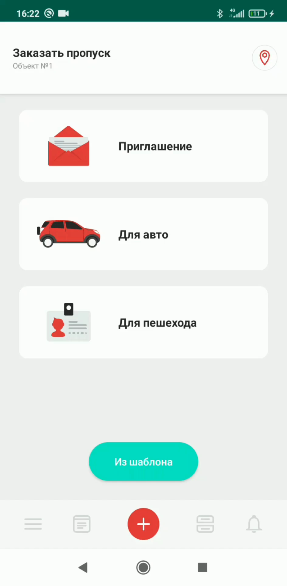
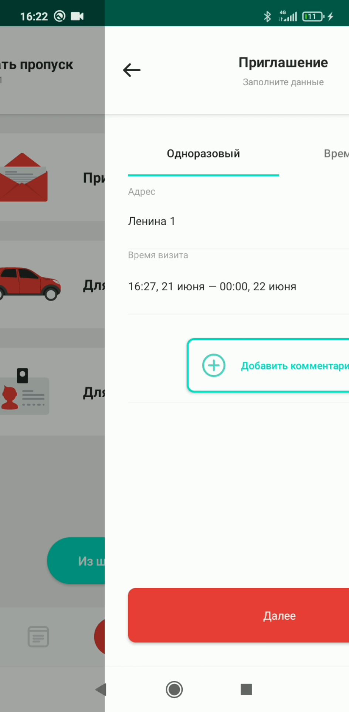
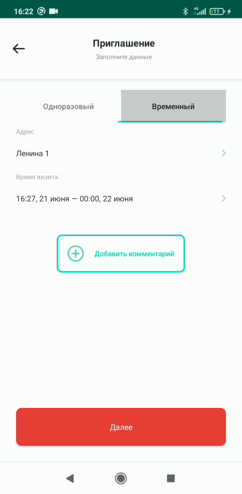
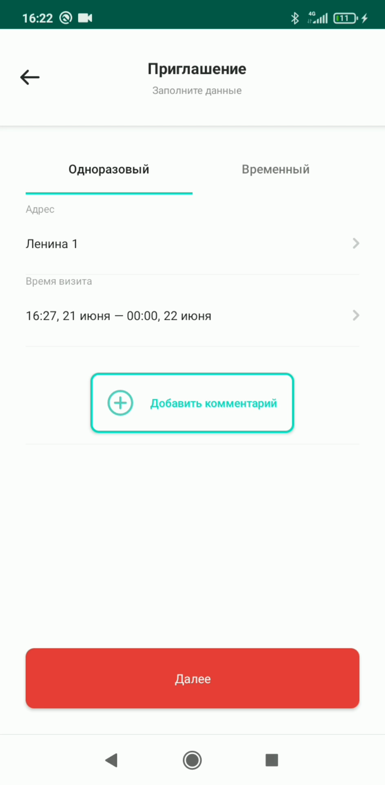
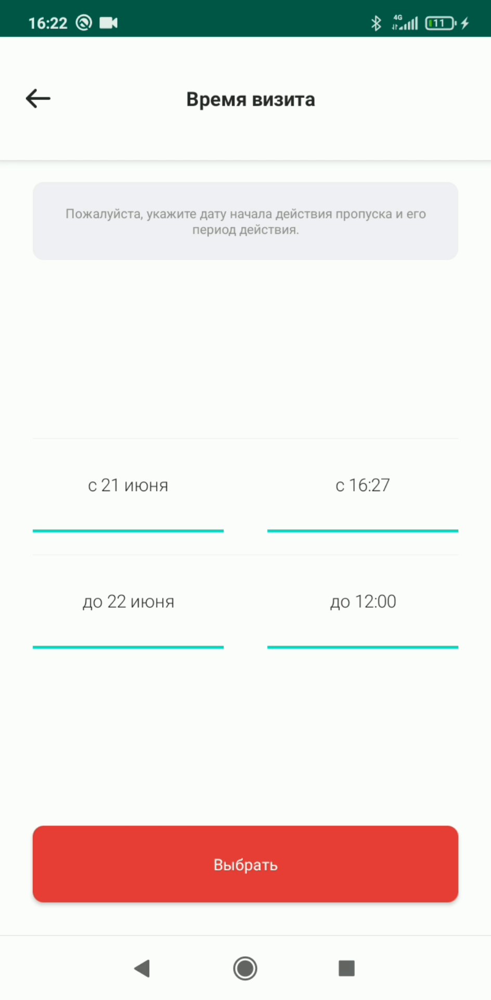
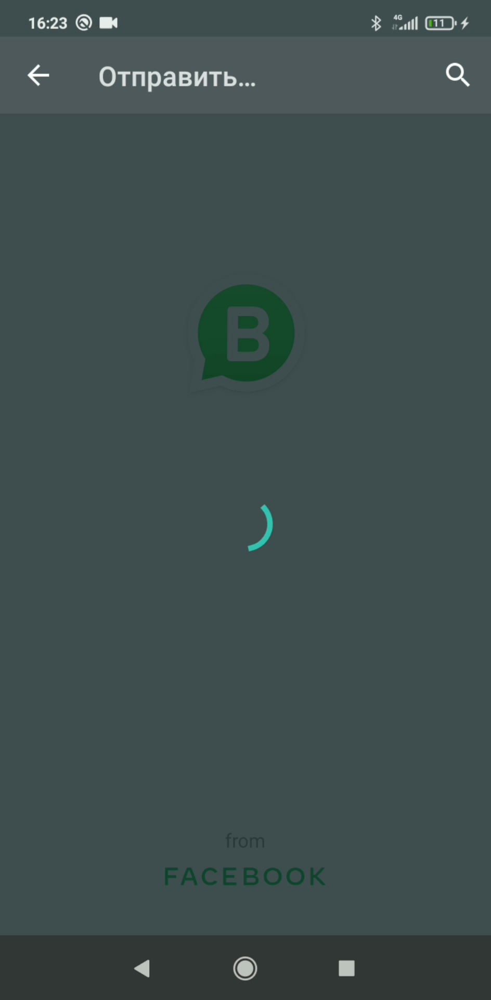

# Создание приглашения

## Метаданные документа

| Параметр | Значение |
|----------|----------|
| **Версия** | 1.0 |
| **Дата создания** | 2026-01-22 |
| **Дата последнего обновления** | 2026-01-22 |
| **Автор** | Система автоматической конвертации |
| **Ответственный за актуальность** | Отдел технической поддержки |
| **Статус** | Актуально |
| **Тип документа** | Обучение |
| **Отдел** | Тех. поддержка |
| **Теги** | приглашение, пропуск, гость, мобильное приложение, инструкция |

---

## Целевая аудитория

**Для кого:** Пользователи мобильного приложения PASS24.online, новые сотрудники техподдержки

**Уровень подготовки:** Начинающий

**Когда использовать:** При обучении работе с мобильным приложением PASS24.online, при консультировании пользователей по созданию приглашений для гостей

---

## Краткое описание

Данная инструкция описывает процесс создания приглашения в мобильном приложении PASS24.online. Документ содержит пошаговое руководство от выбора типа пропуска "Приглашение" до отправки ссылки гостю, включая выбор адреса прибытия, времени визита и получателя приглашения.

---

## Пошаговая инструкция

### Шаг 1: Выбор типа пропуска

**Что делать:**
1. Откройте мобильное приложение PASS24.online
2. Нажмите на тип пропуска **"Приглашение"**

**Где:** Главный экран приложения, раздел создания пропусков

**Результат:** Открывается форма создания приглашения

---

### Шаг 2: Выбор типа визита

**Что делать:**
1. Выберите тип визита: **разовый** или **временный**

**Где:** Форма создания приглашения, поле "Тип визита"

**Результат:** Выбран тип визита для приглашения

---

### Шаг 3: Ввод адреса прибытия

**Что делать:**
1. Введите **адрес прибытия** гостя

**Где:** Форма создания приглашения, поле "Адрес прибытия"

**Результат:** Адрес прибытия указан

---

### Шаг 4: Выбор времени визита

**Что делать:**
1. Выберите **время визита** (дату и время)

**Где:** Форма создания приглашения, поле "Время визита"

**Результат:** Время визита выбрано

---

### Шаг 5: Добавление комментария (опционально)

**Что делать:**
1. При необходимости оставьте **комментарий** к приглашению

**Где:** Форма создания приглашения, поле "Комментарий"

**Результат:** Комментарий добавлен (если был указан)

---

### Шаг 6: Переход к отправке приглашения

**Что делать:**
1. Нажмите кнопку **"Далее"**

**Где:** Форма создания приглашения, нижняя часть экрана

**Результат:** Открывается экран отправки приглашения

---

### Шаг 7: Отправка ссылки

**Что делать:**
1. Нажмите кнопку **"Отправить ссылку"**

**Где:** Экран отправки приглашения

**Результат:** Открывается список контактов для выбора получателя

---

### Шаг 8: Выбор получателя приглашения

**Что делать:**
1. Выберите **гостя**, которому отправляете приглашение, из списка контактов

**Где:** Экран выбора получателя приглашения

**Результат:** Получатель приглашения выбран

---

### Шаг 9: Завершение процесса

**Что делать:**
1. После выбора получателя приглашение отправляется автоматически

**Где:** Система обрабатывает отправку

**Результат:** Приглашение отправлено гостю. После того, как гость заполнит данные пропуска, вам придет уведомление.

---

## Контрольный чек-лист

- [ ] Выбран тип пропуска "Приглашение"
- [ ] Выбран тип визита (разовый или временный)
- [ ] Введен адрес прибытия
- [ ] Выбрано время визита
- [ ] При необходимости добавлен комментарий
- [ ] Нажата кнопка "Отправить ссылку"
- [ ] Выбран получатель приглашения из списка контактов
- [ ] Приглашение успешно отправлено
- [ ] Получено уведомление о заполнении пропуска гостем (после заполнения)

---

## Типичные ошибки и их решение

| Ошибка | Причина | Решение |
|--------|---------|---------|
| Не отображается список контактов | Контакты не добавлены в приложение | Добавить контакты в раздел "Гости" в приложении |
| Гость не получил приглашение | Неверный номер телефона или email | Проверить корректность контактных данных гостя |
| Не приходит уведомление | Уведомления отключены | Проверить настройки уведомлений в приложении |

---

## Дополнительная информация

**Важно:** После отправки приглашения гость получает ссылку для заполнения данных пропуска. Только после того, как гость заполнит все необходимые данные, пропуск будет создан и вам придет уведомление.

---

## Связанные материалы

- [1. Пропуск для пешехода](1.%20Пропуск%20для%20пешехода.md)
- [2. Пропуск на автомобиль](2.%20Пропуск%20на%20автомобиль.md)
- [6. Мои пропуска](6.%20Мои%20пропуска.md)

---

## История изменений

| Версия | Дата | Автор | Изменения |
|--------|------|-------|-----------|
| 1.0 | 2026-01-22 | Система автоматической конвертации | Первоначальная версия на основе видео |

---
