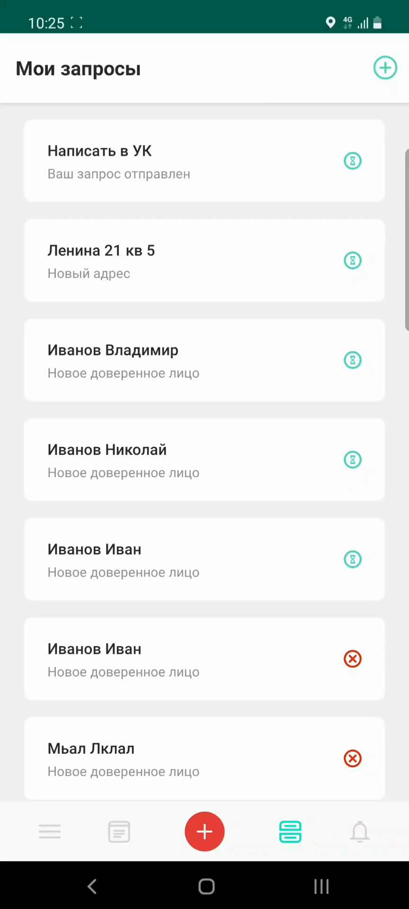
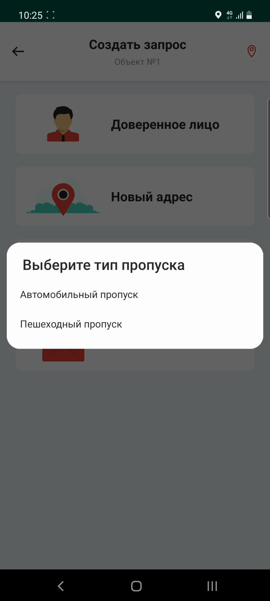
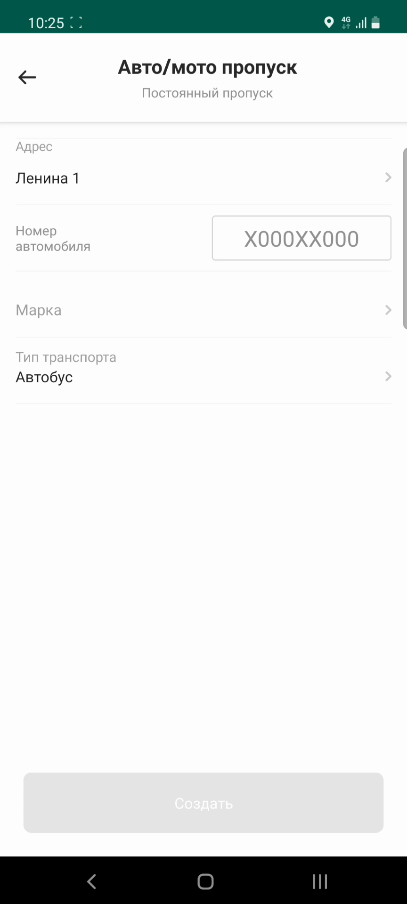
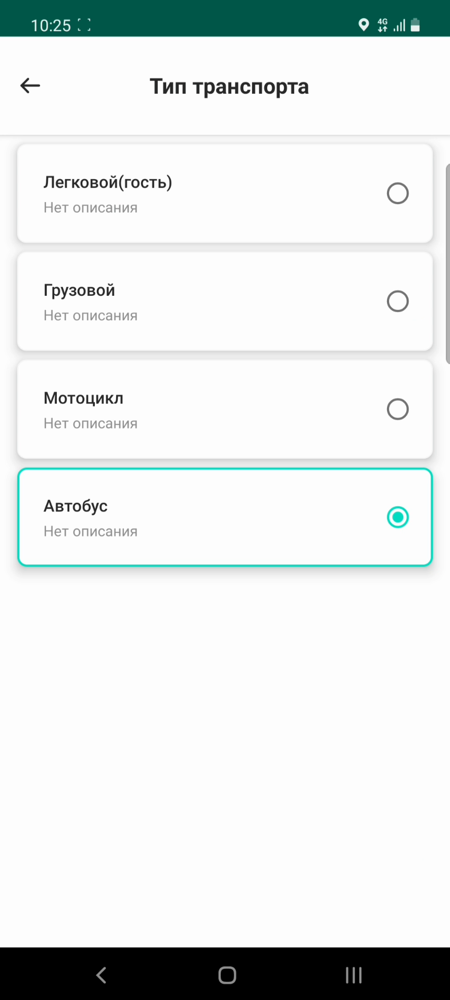

# Запрос на постоянный автомобильный пропуск

## Метаданные документа

| Параметр | Значение |
|----------|----------|
| **Версия** | 1.0 |
| **Дата создания** | 2026-01-22 |
| **Дата последнего обновления** | 2026-01-22 |
| **Автор** | Система автоматической конвертации |
| **Ответственный за актуальность** | Отдел технической поддержки |
| **Статус** | Актуально |
| **Тип документа** | Обучение |
| **Отдел** | Тех. поддержка |
| **Теги** | запрос, постоянный пропуск, автомобиль, мобильное приложение, инструкция |

---

## Целевая аудитория

**Для кого:** Пользователи мобильного приложения PASS24.online, новые сотрудники техподдержки

**Уровень подготовки:** Начинающий

**Когда использовать:** При обучении работе с мобильным приложением PASS24.online, при консультировании пользователей по созданию запросов на постоянные автомобильные пропуски

---

## Краткое описание

Данная инструкция описывает процесс создания запроса на постоянный пропуск на автомобиль в мобильном приложении PASS24.online. Документ содержит пошаговое руководство от создания запроса до его отправки в управляющую компанию, включая заполнение данных об автомобиле и выбор типа транспорта.

---

## Пошаговая инструкция

### Шаг 1: Открытие формы создания запроса

**Что делать:**
1. Откройте мобильное приложение PASS24.online
2. Нажмите кнопку **"Плюс"** в правом верхнем углу экрана

**Где:** Главный экран приложения, кнопка "+" в правом верхнем углу

**Результат:** Открывается меню выбора типа запроса

---

### Шаг 2: Выбор типа запроса

**Что делать:**
1. Нажмите на тип запроса **"Постоянный пропуск"**

**Где:** Меню выбора типа запроса

**Результат:** Открывается форма выбора типа пропуска

---

### Шаг 3: Выбор типа пропуска

**Что делать:**
1. Выберите тип пропуска **"Автомобильный"**

**Где:** Форма выбора типа пропуска

**Результат:** Открывается форма создания запроса на постоянный автомобильный пропуск

---

### Шаг 4: Выбор адреса

**Что делать:**
1. Выберите **адрес** из списка доступных адресов

**Где:** Форма создания запроса, поле "Адрес"

**Результат:** Адрес выбран

---

### Шаг 5: Ввод данных об автомобиле

**Что делать:**
1. Введите **номер** автомобиля
2. Введите **марку** автомобиля

**Где:** Форма создания запроса, поля "Номер" и "Марка"

**Результат:** Данные об автомобиле заполнены

---

### Шаг 6: Выбор типа транспорта

**Что делать:**
1. Выберите **тип транспорта** из списка доступных типов (если поле отображается)

**Где:** Форма создания запроса, поле "Тип транспорта"

**Результат:** Тип транспорта выбран (если доступен)

**Важно:** Тип транспорта — это индивидуальная настройка и отображается не у всех пользователей.

---

### Шаг 7: Создание запроса

**Что делать:**
1. Нажмите кнопку **"Создать"**

**Где:** Форма создания запроса, нижняя часть экрана

**Результат:** Запрос успешно отправлен

---

### Шаг 8: Подтверждение отправки

**Что делать:**
1. Дождитесь подтверждения об успешной отправке запроса

**Где:** Экран подтверждения

**Результат:** Отображается сообщение об успешной отправке запроса

**Важно:** Решение по запросу принимает ваша управляющая компания.

---

## Контрольный чек-лист

- [ ] Нажата кнопка "Плюс" в правом верхнем углу
- [ ] Выбран тип запроса "Постоянный пропуск"
- [ ] Выбран тип пропуска "Автомобильный"
- [ ] Выбран адрес из списка доступных
- [ ] Введен номер автомобиля
- [ ] Введена марка автомобиля
- [ ] Выбран тип транспорта (если доступен)
- [ ] Нажата кнопка "Создать"
- [ ] Запрос успешно отправлен
- [ ] Получено подтверждение об отправке

---

## Типичные ошибки и их решение

| Ошибка | Причина | Решение |
|--------|---------|---------|
| Не отображается поле "Тип транспорта" | Индивидуальная настройка недоступна | Это нормально, поле отображается не у всех пользователей |
| Запрос не отправляется | Не заполнены обязательные поля | Проверить заполнение всех обязательных полей |
| Не отображается список адресов | Пользователь не привязан к объекту | Обратиться в управляющую компанию для привязки к объекту |

---

## Дополнительная информация

**Важно:** 
- Решение по запросу на постоянный пропуск принимает управляющая компания
- После отправки запроса необходимо дождаться решения от УК
- Статус запроса можно отслеживать в разделе "Мои запросы"

---

## Связанные материалы

- [2. Пропуск на автомобиль](2.%20Пропуск%20на%20автомобиль.md)
- [5. Запрос на постоянный пешеходный пропуск](5.%20Запрос%20на%20постоянный%20пешеходный%20пропуск.md)
- [6. Мои пропуска](6.%20Мои%20пропуска.md)

---

## История изменений

| Версия | Дата | Автор | Изменения |
|--------|------|-------|-----------|
| 1.0 | 2026-01-22 | Система автоматической конвертации | Первоначальная версия на основе видео |

---
