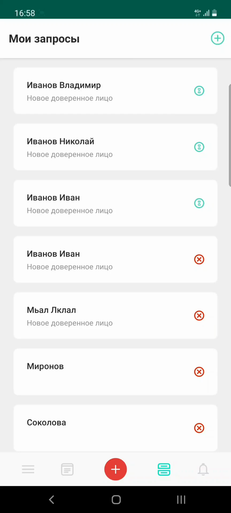
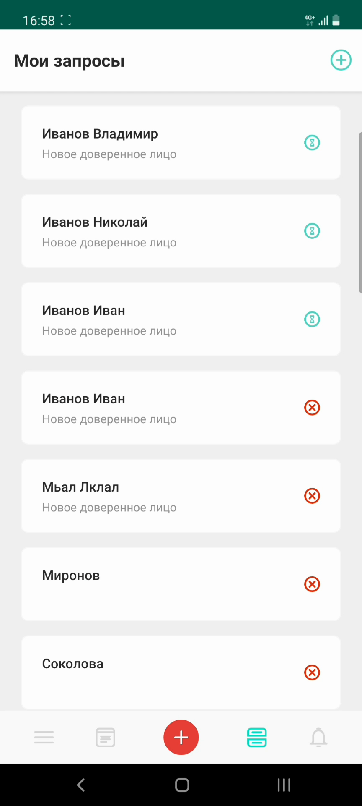
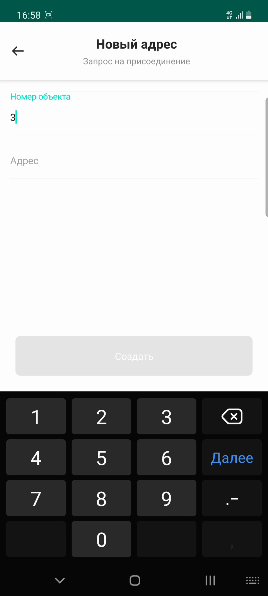
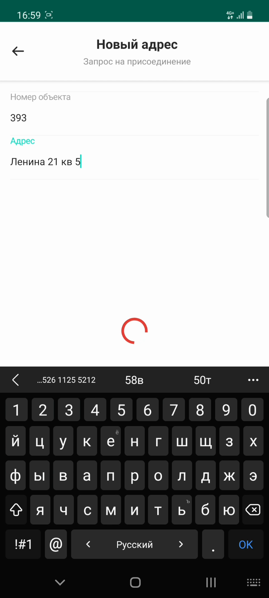

# Запрос на новый адрес

## Метаданные документа

| Параметр | Значение |
|----------|----------|
| **Версия** | 1.0 |
| **Дата создания** | 2026-01-22 |
| **Дата последнего обновления** | 2026-01-22 |
| **Автор** | Система автоматической конвертации |
| **Ответственный за актуальность** | Отдел технической поддержки |
| **Статус** | Актуально |
| **Тип документа** | Обучение |
| **Отдел** | Тех. поддержка |
| **Теги** | запрос, адрес, объект, мобильное приложение, инструкция |

---

## Целевая аудитория

**Для кого:** Пользователи мобильного приложения PASS24.online, новые сотрудники техподдержки

**Уровень подготовки:** Начинающий

**Когда использовать:** При обучении работе с мобильным приложением PASS24.online, при консультировании пользователей по добавлению нового адреса или присоединению к другому объекту

---

## Краткое описание

Данная инструкция описывает процесс создания запроса на новый адрес в мобильном приложении PASS24.online. Документ содержит пошаговое руководство от создания запроса до его отправки в управляющую компанию. Используйте данный запрос, если вам необходимо добавить еще один адрес или присоединиться к другому объекту.

---

## Когда использовать запрос на новый адрес

Используйте данный запрос в следующих случаях:
- Вам необходимо добавить еще один адрес к существующему аккаунту
- Вы хотите присоединиться к другому объекту
- Вам нужно получить доступ к пропускам для другого адреса

---

## Пошаговая инструкция

### Шаг 1: Открытие формы создания запроса

**Что делать:**
1. Откройте мобильное приложение PASS24.online
2. Нажмите кнопку **"Плюс"** в правом верхнем углу экрана

**Где:** Главный экран приложения, кнопка "+" в правом верхнем углу

**Результат:** Открывается меню выбора типа запроса

---

### Шаг 2: Выбор типа запроса

**Что делать:**
1. Нажмите на тип запроса **"Новый адрес"**

**Где:** Меню выбора типа запроса

**Результат:** Открывается форма создания запроса на новый адрес

---

### Шаг 3: Ввод номера объекта

**Что делать:**
1. Введите **номер объекта**, к которому хотите присоединиться

**Где:** Форма создания запроса, поле "Номер объекта"

**Результат:** Номер объекта указан

---

### Шаг 4: Ввод адреса проживания

**Что делать:**
1. Введите **адрес вашего проживания**, чтобы сотрудники управляющей компании могли вас идентифицировать

**Где:** Форма создания запроса, поле "Адрес проживания"

**Результат:** Адрес проживания указан

**Важно:** Адрес проживания необходим для идентификации пользователя сотрудниками управляющей компании при рассмотрении запроса.

---

### Шаг 5: Создание запроса

**Что делать:**
1. Нажмите кнопку **"Создать"**

**Где:** Форма создания запроса, нижняя часть экрана

**Результат:** Запрос успешно отправлен

---

### Шаг 6: Подтверждение отправки

**Что делать:**
1. Дождитесь подтверждения об успешной отправке запроса

**Где:** Экран подтверждения

**Результат:** Отображается сообщение об успешной отправке запроса

**Важно:** Решение по запросу принимает ваша управляющая компания.

---

## Контрольный чек-лист

- [ ] Нажата кнопка "Плюс" в правом верхнем углу
- [ ] Выбран тип запроса "Новый адрес"
- [ ] Введен номер объекта
- [ ] Введен адрес проживания для идентификации
- [ ] Нажата кнопка "Создать"
- [ ] Запрос успешно отправлен
- [ ] Получено подтверждение об отправке

---

## Типичные ошибки и их решение

| Ошибка | Причина | Решение |
|--------|---------|---------|
| Неверный номер объекта | Ошибка ввода | Проверить правильность ввода номера объекта, уточнить у управляющей компании |
| Запрос не отправляется | Не заполнены обязательные поля | Проверить заполнение всех обязательных полей (номер объекта, адрес проживания) |
| Неверный адрес проживания | Ошибка ввода | Ввести полный адрес проживания для идентификации сотрудниками УК |

---

## Дополнительная информация

**Важно:** 
- Решение по запросу на новый адрес принимает управляющая компания
- После отправки запроса необходимо дождаться решения от УК
- Статус запроса можно отслеживать в разделе "Мои запросы"
- После одобрения запроса новый адрес появится в списке доступных адресов

---

## Связанные материалы

- [4. Запрос на постоянный автомобильный пропуск](4.%20Запрос%20на%20постоянный%20автомобильный%20пропуск.md)
- [5. Запрос на постоянный пешеходный пропуск](5.%20Запрос%20на%20постоянный%20пешеходный%20пропуск.md)
- [7. Запрос на доверенность](7.%20Запрос%20на%20доверенность.md)

---

## История изменений

| Версия | Дата | Автор | Изменения |
|--------|------|-------|-----------|
| 1.0 | 2026-01-22 | Система автоматической конвертации | Первоначальная версия на основе видео |

---
