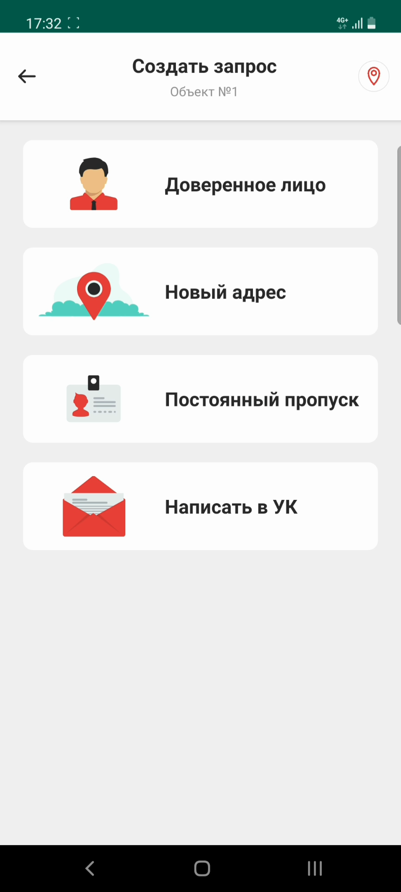
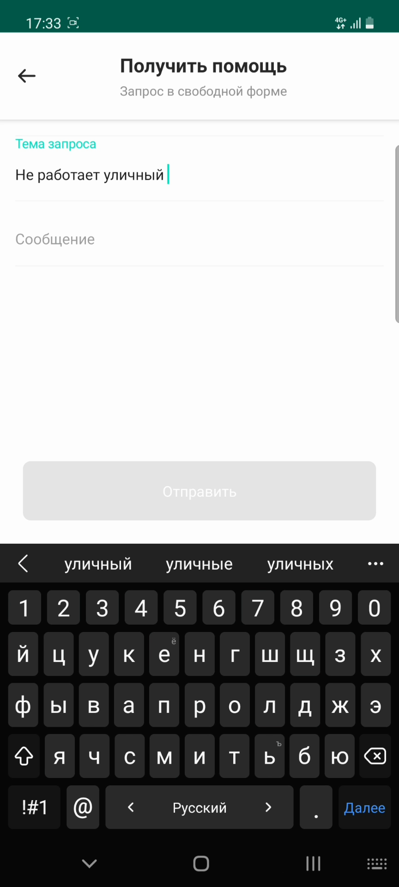
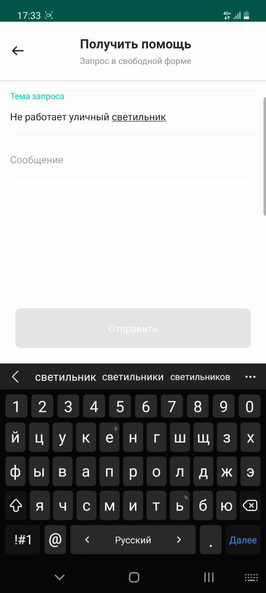
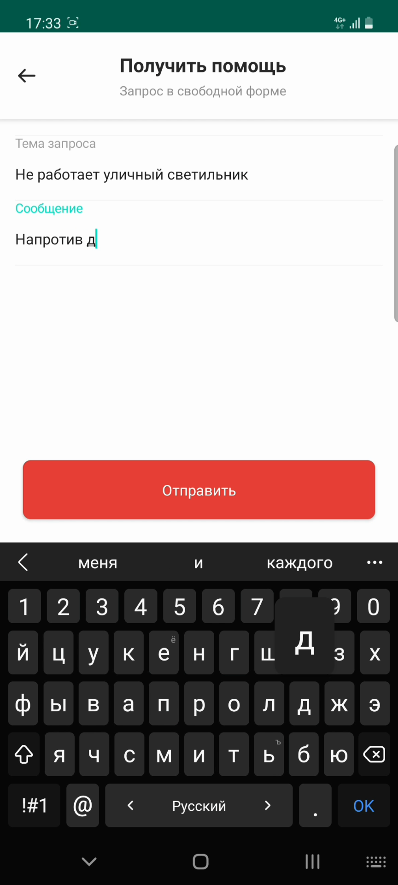
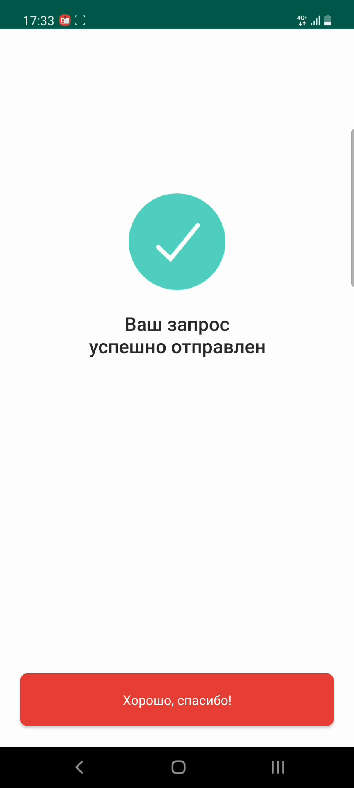

# Запрос написать в УК

## Метаданные документа

| Параметр | Значение |
|----------|----------|
| **Версия** | 1.0 |
| **Дата создания** | 2026-01-22 |
| **Дата последнего обновления** | 2026-01-22 |
| **Автор** | Система автоматической конвертации |
| **Ответственный за актуальность** | Отдел технической поддержки |
| **Статус** | Актуально |
| **Тип документа** | Обучение |
| **Отдел** | Тех. поддержка |
| **Теги** | запрос, управляющая компания, обращение, мобильное приложение, инструкция |

---

## Целевая аудитория

**Для кого:** Пользователи мобильного приложения PASS24.online, новые сотрудники техподдержки

**Уровень подготовки:** Начинающий

**Когда использовать:** При обучении работе с мобильным приложением PASS24.online, при консультировании пользователей по отправке обращений в управляющую компанию

---

## Краткое описание

Данная инструкция описывает процесс создания запроса для отправки обращения в управляющую компанию через мобильное приложение PASS24.online. Документ содержит пошаговое руководство от создания запроса до его отправки, включая выбор темы запроса и ввод сообщения. С помощью этого запроса вы можете отправить в УК показания счетчиков, вызвать мастера, сообщить о проблеме или нарушении, оставить отзыв о работе УК.

---

## Возможности запроса "Написать в УК"

С помощью данного запроса вы можете:

- **Отправить показания счетчиков** — передать показания счетчиков воды, электричества и т.д.
- **Вызвать мастера** — запросить вызов специалиста для решения технических проблем
- **Сообщить о проблеме или нарушении** — уведомить УК о возникших проблемах
- **Оставить отзыв о работе УК** — оставить обратную связь о работе управляющей компании

**Важно:** Тема запросов регламентируется вашей управляющей компанией.

---

## Пошаговая инструкция

### Шаг 1: Открытие формы создания запроса

**Что делать:**
1. Откройте мобильное приложение PASS24.online
2. Нажмите кнопку **"Плюс"** в правом верхнем углу экрана

**Где:** Главный экран приложения, кнопка "+" в правом верхнем углу

**Результат:** Открывается меню выбора типа запроса

---

### Шаг 2: Выбор типа запроса

**Что делать:**
1. Нажмите на тип запроса **"Написать в УК"**

**Где:** Меню выбора типа запроса

**Результат:** Открывается форма создания запроса в УК

---

### Шаг 3: Ввод темы запроса

**Что делать:**
1. Введите **тему запроса** (например: "Показания счетчиков", "Вызов мастера", "Проблема с водоснабжением" и т.д.)

**Где:** Форма создания запроса, поле "Тема запроса"

**Результат:** Тема запроса указана

**Важно:** Тема запросов регламентируется вашей управляющей компанией. Используйте темы, указанные в списке доступных тем или рекомендованные УК.

---

### Шаг 4: Примеры использования запроса

**Что делать:**
Ознакомьтесь с примерами использования запроса:

- **Показания счетчиков** — передача показаний счетчиков воды, электричества
- **Вызов мастера** — запрос на вызов специалиста для решения технических проблем
- **Сообщение о проблеме или нарушении** — уведомление УК о возникших проблемах
- **Отзыв о работе УК** — оставление обратной связи о работе управляющей компании

---

### Шаг 5: Ввод сообщения

**Что делать:**
1. Введите **сообщение** с деталями вашего запроса

**Где:** Форма создания запроса, поле "Сообщение"

**Результат:** Сообщение введено

---

### Шаг 6: Создание запроса

**Что делать:**
1. Нажмите кнопку **"Создать"**

**Где:** Форма создания запроса, нижняя часть экрана

**Результат:** Запрос успешно отправлен

---

### Шаг 7: Подтверждение отправки

**Что делать:**
1. Дождитесь подтверждения об успешной отправке запроса

**Где:** Экран подтверждения

**Результат:** Отображается сообщение об успешной отправке запроса

**Важно:** Решение по запросу принимает ваша управляющая компания.

---

## Контрольный чек-лист

- [ ] Нажата кнопка "Плюс" в правом верхнем углу
- [ ] Выбран тип запроса "Написать в УК"
- [ ] Введена тема запроса (соответствует регламенту УК)
- [ ] Введено сообщение с деталями запроса
- [ ] Нажата кнопка "Создать"
- [ ] Запрос успешно отправлен
- [ ] Получено подтверждение об отправке

---

## Типичные ошибки и их решение

| Ошибка | Причина | Решение |
|--------|---------|---------|
| Тема запроса не соответствует регламенту | Использована неверная тема | Использовать темы, указанные в списке доступных тем или рекомендованные УК |
| Запрос не отправляется | Не заполнены обязательные поля | Проверить заполнение всех обязательных полей (тема, сообщение) |
| Сообщение слишком короткое | Недостаточно информации | Добавить детали в сообщение для лучшего понимания запроса |

---

## Дополнительная информация

**Важно:** 
- Решение по запросу принимает управляющая компания
- После отправки запроса необходимо дождаться ответа от УК
- Статус запроса можно отслеживать в разделе "Мои запросы"
- Тема запросов должна соответствовать регламенту, установленному вашей управляющей компанией

---

## Примеры тем запросов

В зависимости от регламента вашей управляющей компании, доступны следующие темы (примеры):

- Показания счетчиков
- Вызов мастера
- Проблема с водоснабжением
- Проблема с отоплением
- Проблема с электричеством
- Нарушение правил проживания
- Отзыв о работе УК
- Другое

**Примечание:** Список доступных тем может отличаться в зависимости от управляющей компании.

---

## Связанные материалы

- [4. Запрос на постоянный автомобильный пропуск](4.%20Запрос%20на%20постоянный%20автомобильный%20пропуск.md)
- [5. Запрос на постоянный пешеходный пропуск](5.%20Запрос%20на%20постоянный%20пешеходный%20пропуск.md)
- [7. Запрос на доверенность](7.%20Запрос%20на%20доверенность.md)
- [8. Запрос на новый адрес](8.%20Запрос%20на%20новый%20адрес.md)

---

## История изменений

| Версия | Дата | Автор | Изменения |
|--------|------|-------|-----------|
| 1.0 | 2026-01-22 | Система автоматической конвертации | Первоначальная версия на основе видео |

---
