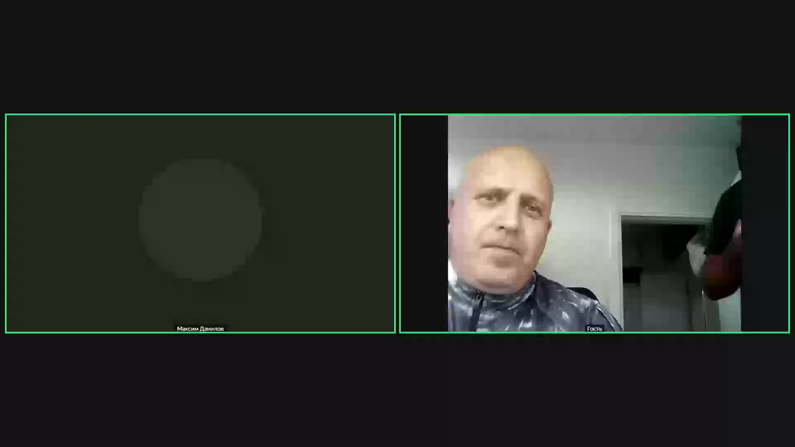
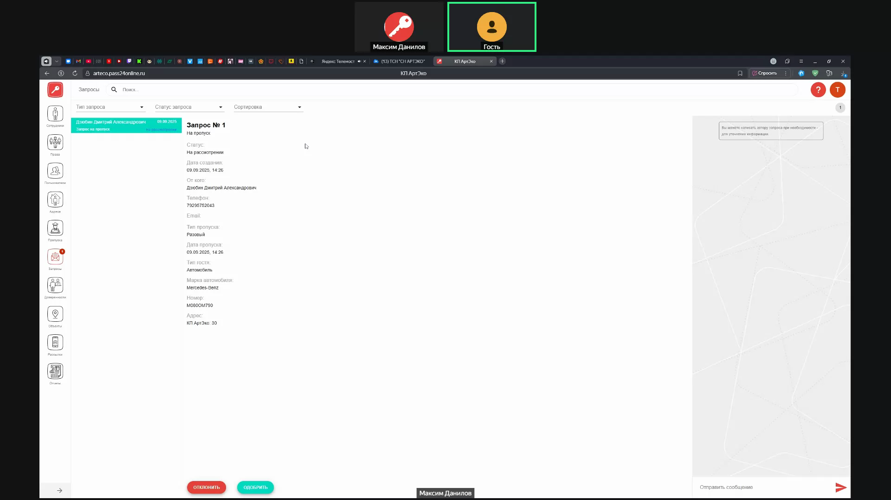
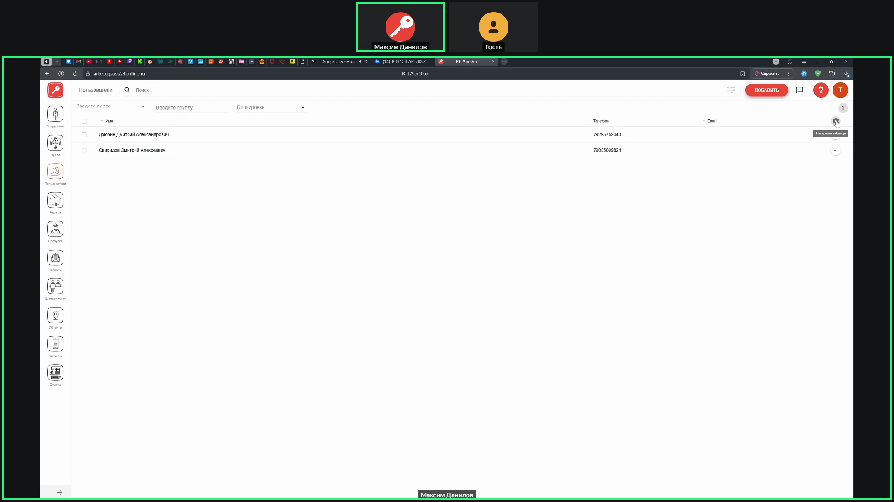
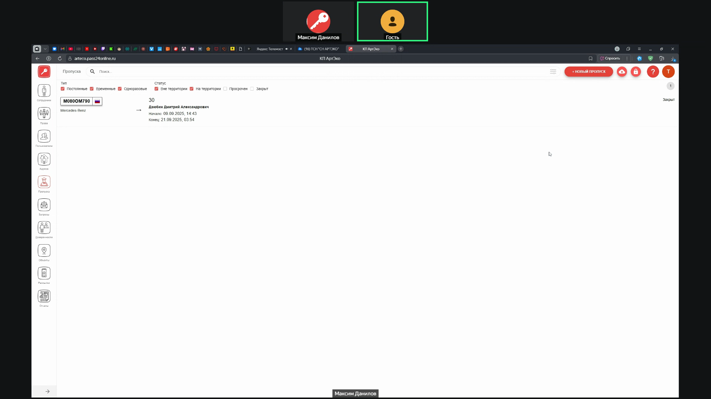
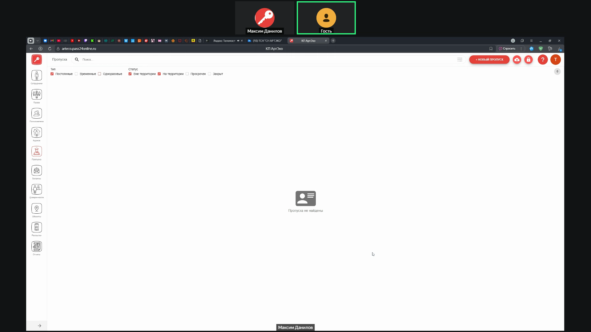

# Обучение администраторов PASS24.online — Артека

## Метаданные документа

| Параметр | Значение |
| --- | --- |
| **Версия** | 1.0 |
| **Дата создания** | 2025-01-22 |
| **Дата последнего обновления** | 2025-01-22 |
| **Автор** | Система автоматической конвертации |
| **Ответственный за актуальность** | Отдел сопровождения клиентов |
| **Статус** | Актуально |
| **Тип документа** | Обучение |
| **Отдел** | ОС |
| **Теги** | обучение, PASS24.online, веб-интерфейс, администратор, инструкция, Артека |

---

## Целевая аудитория

**Для кого:** Менеджеры по сопровождению клиентов, новые сотрудники ОС, администраторы облака PASS24 (объект Артека)

**Уровень подготовки:** Начинающий

**Когда использовать:** При обучении работе с веб-интерфейсом PASS24.online: модули сотрудники, права, пользователи, адреса, пропуска, объекты (настройки), доверенности, рассылка, работа с запросами

---

## Краткое описание

Данный документ содержит структурированное обучение по веб-интерфейсу PASS24.online на основе записи встречи от 09.09.2025 для объекта Артека. В документе рассмотрены все основные модули системы: сотрудники, права, пользователи, адреса, пропуска, объекты (настройки), доверенности, рассылка. Также описаны процессы авторизации, массовой загрузки, блокировок, работа с запросами, экспорт отчётов и интеграция с камерами.

---

## Предварительные требования

**Необходимые знания:**

- Базовое понимание работы веб-интерфейсов
- Понимание концепции пропускной системы

**Необходимый доступ:**

- Права главного администратора в системе PASS24.online
- Доступ к веб-интерфейсу облака

**Необходимые материалы/ресурсы:**

- Ссылка на ваше облако PASS24.online
- Excel-таблицы для массовой загрузки (при необходимости)

---

## Основной контент

### Введение

В каждом модуле веб-интерфейса PASS24.online есть **знак вопроса** — это гиперссылка в базу знаний, где подробно описано, за что отвечает модуль и как с ним работать. При возникновении вопросов можно обратиться к базе знаний или в техническую поддержку.

**Рекомендация:** Если хотите параллельно выполнять действия вместе с инструктором, откройте ссылку на ваше облако в отдельной вкладке

---

### Модуль Сотрудники

**Назначение:** Сотрудники — это те, кто имеет административный доступ к веб-интерфейсу, где осуществляется вся работа с системой PASS24.online.

**Права главного администратора:**
- Абсолютно все права на редактирование и изменение системы
- Может добавлять помощников (других администраторов)

#### Добавление нового сотрудника

**Что делать:**

1. Нажмите **«Новый сотрудник»**
2. Заполните данные:
   - **Имя** (обязательно)
   - **Почта** (обязательно, используется для входа)
   - **Пароль** (обязательно)
   - **Номер телефона** (необязательно, но можно указать)
3. Выберите **группу прав**:
   - **Администраторы** — для администраторов системы
   - **Охрана** — для помощников охраны
4. Поставьте галочку напротив **объекта** (например, Артека)
5. Нажмите **«Сохранить»**

**Где:** Раздел «Сотрудники», кнопка «Новый сотрудник»

**Результат:** Сотрудник добавлен с административными правами

**Важно:** 
- Почта используется для авторизации в веб-интерфейсе
- Пароль можно задать любой (рекомендуется сохранить в безопасном месте)
- Идентичный вход будет у всех сотрудников охраны

#### Редактирование прав сотрудника

**Что делать:**

1. Нажмите **три точки** напротив сотрудника
2. Выберите **«Редактировать права»**
3. Пройдитесь по каждому модулю:
   - Выберите нужные настройки (разрешить/запретить)
   - Для пропусков можно выбрать только определённый тип (например, только разовые)
   - Переведите ползунок на активность для нужных типов
4. Нажмите **«Сохранить»**

**Где:** Раздел «Сотрудники», список сотрудников, три точки → «Редактировать права»

**Результат:** Права сотрудника настроены индивидуально

**Пример:** Можно разрешить создание пропусков, но только разовых. Охранник сможет создавать только разовые пропуска, остальные типы будут запрещены.

**Наследование от родительской группы:**
- Если сотрудник создан в группе «Охрана» или «Администраторы», он наследует все права этой группы
- Индивидуальные настройки прав применяются дополнительно к правам группы

---

### Модуль Права

**Назначение:** Создание групп прав для разделения сотрудников по уровням доступа.

**Основные действия:**

- **Создание группы прав:** Выбирается при создании сотрудника (Администраторы, Охрана)
- **Настройка прав группы:** Нажмите на **шестерёнку** у группы, пройдитесь по модулям, выберите необходимые настройки, сохраните
- **Создание подгруппы:** Нажмите на стрелочку у группы «Администраторы», создайте подгруппу

**Где:** Раздел «Права»

**Результат:** Группы прав созданы и настроены

**Примечание:** Подгруппы используются для более детального разделения прав внутри основной группы. Настройка прав группы применяется ко всем сотрудникам этой группы.

---

### Модуль Пользователи

**Назначение:** Пользователи — это собственники поселка, которые будут пользоваться мобильным приложением для создания пропусков.

#### Добавление пользователя вручную

**Что делать:**

1. Перейдите в раздел **«Пользователи»**
2. Нажмите **«Добавить»**
3. Заполните данные:
   - **Фамилия, имя, отчество** (обязательно)
   - **Почта** (необязательно)
   - **Номер телефона** (обязательно, через +7)
4. **Добавьте адрес** — пользователь обязательно должен быть присвоен к адресу
5. Нажмите **«Сохранить»**

**Где:** Раздел «Пользователи», кнопка «Добавить»

**Результат:** Пользователь добавлен в систему и может авторизоваться в мобильном приложении

**Важно:** Пользователь не может существовать без адреса. Если адреса нет, его нужно сначала создать в модуле «Адреса».

#### Первичная авторизация пользователя

**Что делать:**

1. Пользователь заходит в **мобильное приложение**
2. Нажимает **«Забыли пароль»** (так как в системе он уже есть, но пароль не задан)
3. Вводит свой номер телефона
4. Ему приходит **SMS-код** на номер телефона
5. Вводит код, задаёт себе **новый пароль**
6. Авторизуется

**Результат:** Пользователь авторизован и может создавать пропуска

#### Редактирование пользователя

**Что делать:**

1. Нажмите **три точки** напротив пользователя
2. Выберите **«Редактировать»**
3. Можно:
   - Присвоить **второй адрес** (если у пользователя два участка)
   - Заблокировать пользователя (ползунок «Блокировка пользователя»)
   - Добавить **комментарий** (внутренняя заметка, например, «очень конфликтный»)

**Где:** Раздел «Пользователи», список пользователей, три точки → «Редактировать»

**Результат:** Данные пользователя обновлены

#### Отображение адреса в списке пользователей

**Что делать:**

1. В разделе «Пользователи» нажмите **шестерёнку** в правом верхнем углу
2. Поставьте галочку напротив пункта **«Адрес»**
3. Нажмите **«Сохранить»**

**Результат:** В списке пользователей будет видно, к какому адресу привязан пользователь

#### Блокировка пользователя

**Что делать:**

1. Откройте редактирование пользователя
2. Переведите ползунок **«Блокировка пользователя»** в активное состояние
3. При необходимости укажите **комментарий** (внутренняя заметка, например, «злостный неплательщик»)
4. Нажмите **«Сохранить»**

**Что даёт блокировка:**

- Пользователь **не может заказывать пропуска**
- Пропуска, созданные до блокировки, **продолжают функционировать**
- После блокировки пользователь не сможет создать ни одного пропуска

**Где:** Раздел «Пользователи», редактирование пользователя

**Результат:** Пользователь заблокирован

---

### Модуль Адреса

**Назначение:** Управление адресами поселка (дома, участки).

#### Добавление адреса

**Что делать:**

1. Перейдите в раздел **«Адреса»**
2. Нажмите **«Добавить»**
3. Выберите **объект** (например, Артека)
4. Если улицы нет, просто напишите **номер дома**
5. Нажмите **«Сохранить»**

**Где:** Раздел «Адреса», кнопка «Добавить»

**Результат:** Адрес добавлен

#### Массовая загрузка адресов

**Что делать:**

1. В разделе «Адреса» нажмите **«Импорт»** (рядом с кнопкой «Добавить»)
2. Выберите тип:
   - **Пример без пользователей** — если хотите загрузить только адреса
   - **Пример с пользователями** — если хотите загрузить адреса вместе с пользователями
3. Нажмите **«Скачать»** — откроется Excel-табличка по образцу
4. Заполните табличку (строки редактировать нельзя, только добавлять сверху)
5. Выберите **объект**
6. Загрузите заполненную Excel-табличку

**Где:** Раздел «Адреса», кнопка «Импорт»

**Результат:** Адреса и/или пользователи загружены массово

**Примечание:** Если адресов немного (например, 30-50), можно добавить их вручную — это займёт около 10 минут.

#### Блокировка адреса

**Типы блокировки:**

1. **Полная блокировка адреса:**
   - В редактировании адреса переведите ползунок **«Блокировка адреса»** в активное состояние
   - Все пользователи на этом адресе получают блокировку и не могут заказывать пропуска

2. **Блокировка конкретного пользователя на адресе:**
   - В редактировании адреса найдите нужного пользователя
   - Нажмите **замочек** напротив пользователя (при наведении будет написано «Заблокировать пользователя на адресе»)
   - Только этот пользователь будет заблокирован, остальные на адресе смогут заказывать пропуска

**Где:** Раздел «Адреса», редактирование адреса

**Результат:** Адрес и/или пользователь заблокирован

**Важно:** 
- Блокировка применяется только к **новым пропускам**
- Старые пропуска, созданные до блокировки, **не закрываются автоматически**
- Старые пропуска нужно закрывать вручную в разделе «Пропуска»

---

### Модуль Пропуска

#### Создание пропуска через запрос

**Настройка режима работы:**

1. Перейдите в карточку объекта, раздел **«Работа с пропусками»**
2. Выберите режим:
   - **По запросу** — пропуск уходит в раздел «Запросы», требуется одобрение/отклонение
   - **Автоматически** — пропуск сразу попадает в модуль «Пропуска» (активные)

**Где:** Карточка объекта, раздел «Работа с пропусками»

**Результат:** Настройка применена

#### Обработка запроса на пропуск

**Что делать:**

1. Запрос появляется в разделе **«Запросы»**
2. Нажмите на запрос
3. Выберите действие:
   - **«Одобрить»** — пропуск попадает в систему
   - **«Отклонить»** — обязательно укажите причину отклонения (пользователь увидит причину)
4. Нажмите **«Одобрить»** или **«Отклонить»**

**Где:** Раздел «Запросы»

**Результат:** Пропуск одобрен или отклонён

**Важно:** Внизу отображается информация, когда и кем с какой учётной записи было одобрен/отклонён запрос. Все события можно отследить.

#### Смена статуса пропуска

**Что делать:**

1. В разделе «Пропуска» найдите пропуск
2. В поисковой строке введите номер автомобиля (например, А800АА)
3. Нажмите **«Приехал»** — статус меняется на «На территории»
4. При выезде нажмите **«Уехал»** — статус меняется на «Вне территории»

**Где:** Раздел «Пропуска», поисковая строка

**Результат:** Статус пропуска обновлён

**Важно:** 
- При смене статуса пользователь получает уведомление в мобильное приложение
- При наличии камер это будет происходить автоматически
- При ручной работе охрана нажимает кнопки вручную

#### Редактирование пропуска

**Условия редактирования:**

- Пропуск можно редактировать **только до первой смены статуса** (до того, как нажали «Приехал»)
- После первой смены статуса редактирование **полностью запрещено** (сделано в целях безопасности, чтобы не подменялись данные)

**Что делать:**

1. Найдите пропуск в списке
2. Нажмите **«Редактировать»**
3. Внесите изменения
4. Нажмите **«Сохранить»**

**Где:** Раздел «Пропуска», карточка пропуска

**Результат:** Изменения сохранены (если статус ещё не менялся)

#### История событий пропуска

**Что отображается:**

- Все ручные отметки: **«Приехал»**, **«Уехал»**
- Когда было сделано нажатие
- С какой учётной записи было сделано нажатие

**Где:** Карточка пропуска, нажмите на сам пропуск (не на кнопку)

**Результат:** Видна полная история событий пропуска

#### Закрытие пропусков

**Разовые пропуска:**

- Закрываются **автоматически после двух изменений статуса** (приехал → уехал)
- После выезда пропуск автоматически закрывается

**Временные пропуска:**

- Действуют в определённый период (например, неделя)
- Можно закрыть **раньше времени**: выберите пропуск, смените статус на **«Вне территории»**, появится кнопка **«Закрыть»**
- Пока пропуск со статусом «На территории», его закрыть не получится

**Где:** Раздел «Пропуска», карточка пропуска

**Результат:** Пропуск закрыт

#### Поиск пропусков по пользователю

**Задача:** Найти все пропуска определённого пользователя (например, прораба, которого выгнали, и нужно закрыть все его пропуска).

**Что делать:**

1. Перейдите в раздел **«Пропуска»**
2. Справа в поисковой строке нажмите **три полосочки** (фильтры)
3. Выберите **пользователя**
4. Нажмите **«Применить»**

**Результат:** Отображаются все пропуска, заказанные выбранным пользователем

**Где:** Раздел «Пропуска», фильтры

**Применение:** Можно отследить все пропуска прораба или собственника и закрыть их вручную.

#### Экспорт событий пропусков

**Что делать:**

1. В разделе «Пропуска» рядом с кнопкой **«Новый пропуск»** нажмите **«Экспортировать события пропусков»**
2. Выберите **период** (максимум **31 день** назад)
3. При необходимости выберите **пользователя** и **адрес** (если не заполнять, считаются все)
4. Нажмите **«Отправить»**

**Результат:** Отчёт в формате Excel приходит на email, под которым вы авторизованы. В отчёте указаны: время, дата, номер автомобиля, когда приехал/покинул территорию, кто был инициатором события.

**Важно:**

- Выгружается за **31 день** максимум
- Для более поздних событий (более 31 дня) делайте запрос в техподдержку — данные хранятся в архиве
- Отчёт в табличке Excel, можно поставить фильтры по номеру автомобиля, дате въезда/выезда

**Где:** Раздел «Пропуска», кнопка «Экспортировать события пропусков»

**Примечание:** 
- Отчёт приходит только на email, с которого вы авторизованы
- Добавить вторую почту нельзя
- Почту главного администратора можно изменить только через запрос в техническую поддержку

#### Фильтрация пропусков

**Что делать:**

- В разделе «Пропуска» используйте фильтры:
  - **Постоянные** — галочка
  - **Временные** — галочка
  - **Разовые** — галочка
  - **Вне территории** — галочка

**Пример:** Чтобы посмотреть только разовые пропуска, снимите галочки с «Временные» и «Постоянные» — отобразятся только разовые.

**Где:** Раздел «Пропуска», фильтры

**Результат:** Отображаются только пропуска выбранных типов

---

### Модуль Объекты: настройки

#### Автоматическое действие при истечении срока пропуска

**Условие:** Если у пропуска заканчивается срок действия, но автомобиль ещё находится на территории (статус «На территории»).

**Варианты действий:**

1. **Попадает в просроченные** — пропуск подсвечивается красным, как просроченный
2. **Продлевается на один час** — автоматически продлевается на час до того момента, пока не покинет территорию (не будет смены статуса на «Вне территории»)
3. **Закрывается** — автоматически закрывается

**Что делать:**

1. Перейдите в карточку объекта (например, Артека)
2. Спуститесь до пункта **«Работа с пропусками»**
3. Найдите пункт **«Автоматически переводить пропуск»**
4. Выберите нужный вариант
5. Нажмите **«Сохранить»**

**Где:** Карточка объекта, раздел «Работа с пропусками»

**Результат:** Настройка применена

**⚠️ Внимание:** Просроченные пропуска **не закрываются автоматически**, если их не отработать. Они будут копиться, копиться, копиться. У некоторых клиентов накапливается 200+ тысяч просроченных пропусков, и система начинает подтормаживать.

**Рекомендация:** Установить **«Закрывается»**, чтобы просроченные пропуска автоматически закрывались. Когда человек будет выезжать, охрана в разделе «Пропуска» найдёт пропуск, увидит срок его действия и спросит, почему он просрочил время пребывания на территории.

#### Обязательность марки автомобиля

**Что делать:**

1. В карточке объекта, разделе «Работа с пропусками» найдите пункт **«Обязательно ли марка автомобиля для создания пропуска»**
2. Переведите **ползунок** в активное или неактивное состояние

**Где:** Карточка объекта, раздел «Работа с пропусками»

**Результат:** Настройка применена

#### Обязательность формата номера

**Что делать:**

1. В карточке объекта, разделе «Работа с пропусками» найдите пункт **«Обязателен формат номера»**
2. Переведите **ползунок** в активное или неактивное состояние

**Где:** Карточка объекта, раздел «Работа с пропусками»

**Результат:** Настройка применена

**Примечание:** Если формат номера не обязателен, пользователи могут создавать пропуска просто с номером (например, «138»), без региона.

#### Максимальный срок действия пропусков

**Что делать:**

1. В карточке объекта, разделе «Работа с пропусками» найдите пункты:
   - **«Максимальный срок действия разового пропуска»** (в часах)
   - **«Максимальный срок действия временного пропуска»** (в часах)
2. Установите нужное значение:
   - **Разовый:** как правило, ставят 24 часа (или 12 часов — оптимально, так как автоматически ставится до полуночи)
   - **Временный:** зависит от вас (неделя, две, три месяца, полгода)

**Где:** Карточка объекта, раздел «Работа с пропусками»

**Результат:** Ограничение применено

**Важно:** 
- Если установить 0, пользователи могут создать разовый пропуск, который будет действовать, например, с 9 сентября по 31 декабря (один раз, но в любой момент этого периода)
- Рекомендуется установить лимит (например, 12 или 24 часа)

---

### Модуль Доверенности

**Что такое доверенность?**

**Пример:** Собственник купил участок, уехал за границу и сдаёт его на год кому-нибудь. Вместо того, чтобы добавлять арендатора в пользователи с постоянным доступом (потом его отслеживать, выискивать, непонятно, уехал он или нет), можно оформить доверенность.

**Назначение:** Временный доступ в систему со стандартным функционалом пользователя.

**Что происходит:**

1. Пользователь оформляет доверенность через **мобильное приложение** на определённый период (например, год)
2. Ровно через год пользователь-доверенное лицо **автоматически удаляется** из системы
3. Все его активные пропуска, которые он создавал, **закрываются**

**Где:** Модуль «Доверенности» или мобильное приложение

**Результат:** Временный доступ предоставлен, автоматически прекращается по истечении срока

**Примечание:** Если доверенных лиц немного (например, 10-20), можно добавлять их вручную как пользователей, а потом удалять. Но если их много (например, 150), удобнее использовать модуль доверенностей.

---

### Модуль Рассылка

**Назначение:** Отправка массовых уведомлений пользователям мобильного приложения.

**Что делать:**

1. Нажмите **«Создать рассылку»**
2. Выберите **тип рассылки**:
   - **Пользователям по адресам** — если это касается только нескольких адресов
   - **Конкретным пользователям** — например, у них есть задолженности
   - **Пользователям по объекту** — всем пользователям системы
3. Выберите **объект**
4. Введите **заголовок рассылки** и **текст**
5. Нажмите **«Сохранить»**

**Результат:** Пользователям мобильного приложения приходит **push-уведомление** с текстом рассылки.

**Где:** Модуль «Рассылка»

**Применение:** Например, у вас будут ремонтные работы проводиться, и не будет света. Создаёте рассылку, и все пользователи получают уведомление.

---

### Авторизация пользователей

**Два способа добавления пользователя в систему:**

#### 1. Ручное добавление администратором

**Что делать:**

- Используйте раздел «Пользователи», кнопку «Добавить»
- Заполните все необходимые данные и адрес
- Пользователь авторизуется через «Забыли пароль» в мобильном приложении

#### 2. Самостоятельная регистрация пользователя

**Что делать:**

1. Пользователь скачивает **мобильное приложение**
2. Начинает процесс **регистрации**
3. Во время регистрации приложение запросит **номер объекта** (можно посмотреть в разделе «Объекты», например, 21-11)
4. Пользователь вводит номер объекта
5. Создаётся **запрос на присоединение к объекту**

**Обработка запроса:**

1. Администратор видит запрос в разделе **«Запросы»** → **«Все запросы»**
2. Нажимает на запрос
3. Пользователь указывает, к какому адресу планирует присоединиться (может написать номер квитанции и т.д.)
4. Администратор нажимает **«Одобрить»**
5. Выбирает **адрес**, которым присваивает пользователя
6. Нажимает **«Одобрить»**

**Результат:** Пользователь получает уведомление, что заявка одобрена, и может авторизоваться в приложении.

**Преимущество:** Пользователи сами без вашей инициативы могут присоединиться к системе, вам не нужно вручную вносить каждого человека.

---

### Работа с запросами

**Виды запросов:**

- Запрос на присоединение к объекту
- Запрос на пропуск
- Запрос на доверенность

**Обработка запросов:**

1. Запрос появляется в разделе **«Запросы»** → **«Все запросы»**
2. Администратор нажимает на запрос
3. Выбирает действие: **«Одобрить»** или **«Отклонить»**
4. При одобрении запроса на присоединение выбирает **адрес**
5. Пользователь получает уведомление о решении

**Где:** Раздел «Запросы»

**Результат:** Запрос обработан, пользователь уведомлён

---

### Интеграция с камерами

**Что происходит при интеграции:**

- Создаётся отдельный **сотрудник интеграции** (называется «Интеграция»)
- В событиях пропусков будет писаться: **«Статус изменён интеграцией»**
- Это значит, что камера отработала автоматически
- Камеры будут автоматически открывать/закрывать шлагбаум
- Все события будут передаваться в систему, если есть пропуск

**Где:** События отображаются в разделе «Пропуска», история событий пропуска

**Результат:** Полная автоматизация работы КПП

**Примечание:** Пока камер нет, все действия выполняются вручную охраной (нажатие кнопок «Приехал»/«Уехал»).

---

## Часто задаваемые вопросы (FAQ)

### Вопрос 1: Как найти все пропуска определённого пользователя?

**Ответ:** Перейдите в раздел «Пропуска», нажмите фильтры (три полосочки справа), выберите пользователя. Отобразятся все пропуска, заказанные этим пользователем. Можно закрыть их все.

**Связанные материалы:** См. раздел «Модуль Пропуска» → «Поиск пропусков по пользователю»

---

### Вопрос 2: Можно ли заблокировать только одного пользователя на адресе, а остальных оставить активными?

**Ответ:** Да. В редактировании адреса нажмите замочек напротив конкретного пользователя. Только этот пользователь будет заблокирован, остальные на адресе смогут заказывать пропуска.

**Связанные материалы:** См. раздел «Модуль Адреса» → «Блокировка адреса»

---

### Вопрос 3: Что происходит со старыми пропусками при блокировке пользователя?

**Ответ:** Старые пропуска, созданные до блокировки, продолжают функционировать. Блокировка применяется только к новым пропускам. Старые пропуска нужно закрывать вручную в разделе «Пропуска».

---

### Вопрос 4: Можно ли редактировать пропуск после того, как гость приехал?

**Ответ:** Нет. Редактирование пропуска возможно только до первой смены статуса (до того, как нажали «Приехал»). После этого редактирование полностью запрещено в целях безопасности.

---

### Вопрос 5: Что делать с просроченными пропусками?

**Ответ:** Просроченные пропуска не закрываются автоматически, если их не отработать. Они будут копиться и могут замедлить систему. Рекомендуется установить в настройках объекта «Закрывается» вместо «Попадает в просроченные». Просроченные пропуска нужно находить и закрывать вручную.

---

### Вопрос 6: Можно ли добавить вторую почту для получения отчётов?

**Ответ:** Нет. Отчёт приходит только на email, с которого вы авторизованы. Почту главного администратора можно изменить только через запрос в техническую поддержку.

---

### Вопрос 7: Как пользователь может присоединиться к объекту самостоятельно?

**Ответ:** Пользователь скачивает мобильное приложение, начинает регистрацию, вводит номер объекта (можно посмотреть в разделе «Объекты»). Создаётся запрос на присоединение, который администратор одобряет в разделе «Запросы».

---

### Вопрос 8: Что такое доверенность и зачем она нужна?

**Ответ:** Доверенность — это временный доступ в систему на определённый период. Например, собственник сдаёт участок на год. Вместо добавления арендатора как постоянного пользователя, можно оформить доверенность на год. Через год арендатор автоматически удаляется из системы, все его пропуска закрываются.

---

### Вопрос 9: Как работает интеграция с камерами?

**Ответ:** При интеграции создаётся сотрудник «Интеграция». Камеры автоматически открывают/закрывают шлагбаум и передают события в систему. В истории событий пропуска будет писаться «Статус изменён интеграцией».

---

### Вопрос 10: Где найти контакты технической поддержки?

**Ответ:** Вся информация есть на сайте PASS24.online. Также можно обратиться к инструктору или создать заявку в техническую поддержку через веб-интерфейс.

---

## Типичные ошибки и их решение

| Ошибка | Причина | Решение |
| --- | --- | --- |
| Не могу найти все пропуска пользователя | Не используется фильтр по пользователю | Использовать фильтры в разделе «Пропуска», выбрать пользователя |
| Старые пропуска не закрываются при блокировке | Блокировка применяется только к новым пропускам | Найти все пропуска пользователя через фильтры и закрыть их вручную |
| Система подтормаживает | Много просроченных пропусков | В настройках объекта установить «Закрывается» вместо «Попадает в просроченные», найти и закрыть существующие просроченные пропуска |
| Не могу редактировать пропуск | Пропуск уже сменил статус (приехал) | Редактирование возможно только до первого изменения статуса |
| Не вижу адрес пользователя в списке | Не включено отображение адреса | В разделе «Пользователи» нажать шестерёнку, поставить галочку напротив «Адрес», сохранить |
| Пользователь не может присоединиться к объекту | Неправильный номер объекта или запрос не одобрен | Проверить номер объекта в разделе «Объекты», одобрить запрос в разделе «Запросы» |

---

## Контрольный чек-лист

- [ ] Созданы учётные записи сотрудников (охранников)
- [ ] Настроены группы прав (Охрана, Администраторы)
- [ ] Настроены индивидуальные права для сотрудников (при необходимости)
- [ ] Загружены адреса (массово или вручную)
- [ ] Добавлены пользователи (вручную или через запросы)
- [ ] Настроены параметры работы с пропусками (по запросу или автоматически)
- [ ] Настроено автоматическое действие при истечении срока пропуска
- [ ] Настроены лимиты пропусков (разовые, временные)
- [ ] Настроена обязательность марки автомобиля и формата номера
- [ ] Проверена работа с запросами
- [ ] Проверена авторизация пользователей
- [ ] Проверена блокировка пользователей и адресов
- [ ] Проверен экспорт событий пропусков

---

## Связанные материалы

**Инструкции по модулям веб-интерфейса:**

- [Модуль Сотрудники](../03%20Техническая%20поддержка/Инструкции%20PASS24.online/Инструкции%20%20по%20WEB/Модуль%20Сотрудники.md)
- [Модуль Пользователи](../03%20Техническая%20поддержка/Инструкции%20PASS24.online/Инструкции%20%20по%20WEB/Модуль%20Пользователи.md)
- [Модуль Адреса](../03%20Техническая%20поддержка/Инструкции%20PASS24.online/Инструкции%20%20по%20WEB/Модуль%20Адреса.md)
- [Модуль Объекты](../03%20Техническая%20поддержка/Инструкции%20PASS24.online/Инструкции%20%20по%20WEB/Модуль%20Объекты.md)
- [Модуль Пропуска](../03%20Техническая%20поддержка/Инструкции%20PASS24.online/Инструкции%20%20по%20WEB/Модуль%20Пропуска.md)
- [Модуль Доверенности](../03%20Техническая%20поддержка/Инструкции%20PASS24.online/Инструкции%20%20по%20WEB/Модуль%20Доверенности.md)
- [Модуль Рассылка](../03%20Техническая%20поддержка/Инструкции%20PASS24.online/Инструкции%20%20по%20WEB/Модуль%20Рассылка.md)
- [Модуль Запросы](../03%20Техническая%20поддержка/Инструкции%20PASS24.online/Инструкции%20%20по%20WEB/Модуль%20Запросы.md)

**Дополнительные материалы:**

- [Описание работы PASS24online](../03%20Техническая%20поддержка/Инструкции%20PASS24.online/Описание%20работы%20PASS24online.md)
- [Обучение администраторов PASS24.online](./Обучение%20администраторов%20PASS24.online.md)
- FAQ на сайте PASS24.online (раздел для администраторов)

---

## История изменений

| Версия | Дата | Автор | Изменения |
| --- | --- | --- | --- |
| 1.0 | 2025-01-22 | Система автоматической конвертации | Первоначальная версия на основе записи встречи от 09.09.2025, структурирована по модулям, убран раздел «Сегменты с временными метками», добавлены скриншоты |

---
