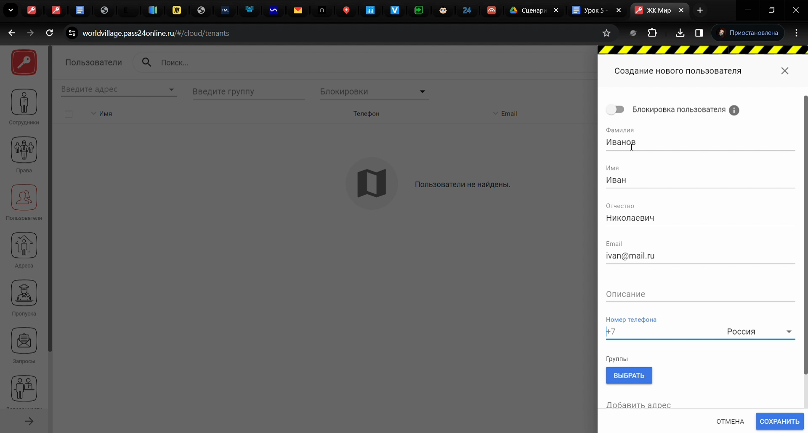
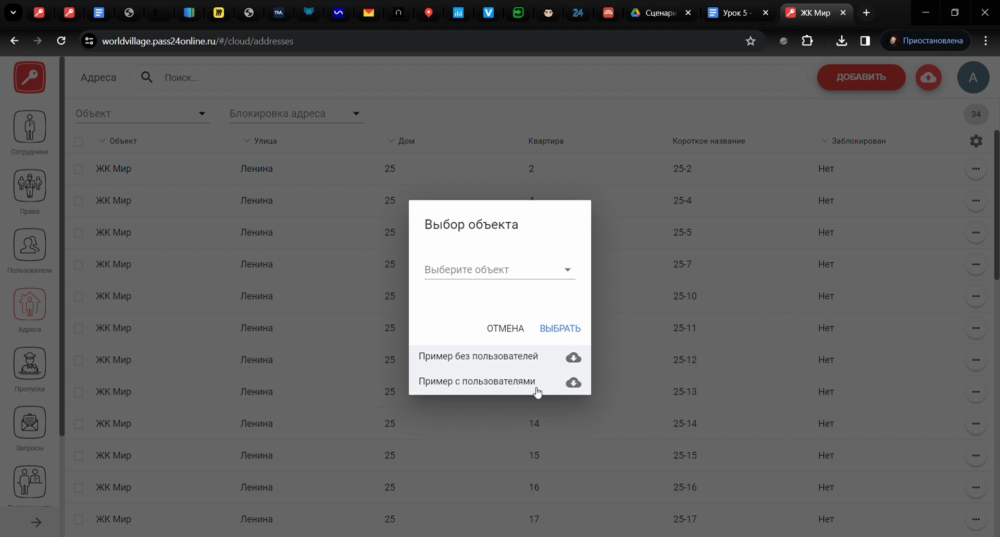
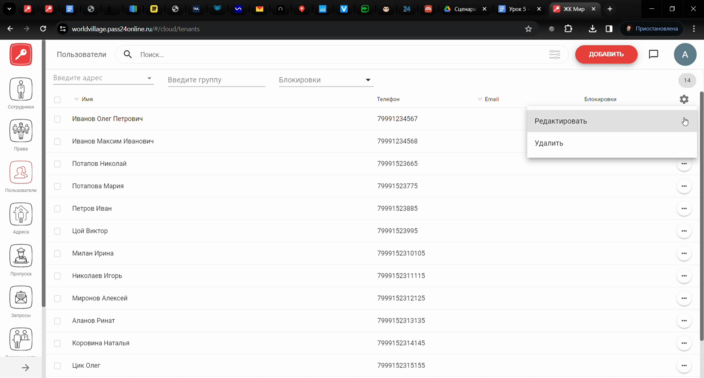
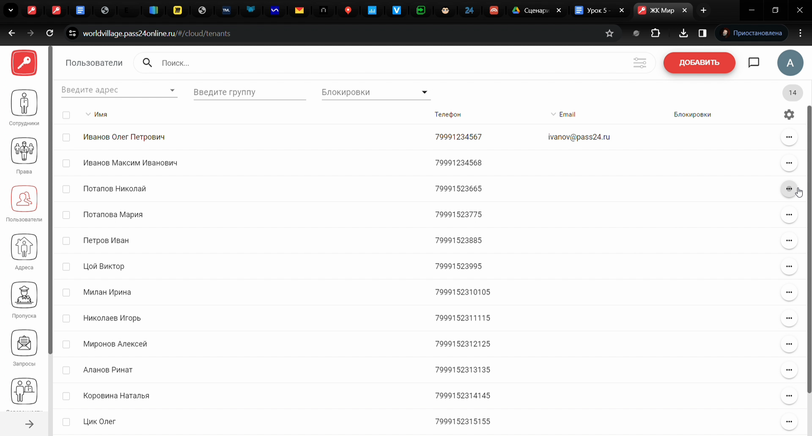
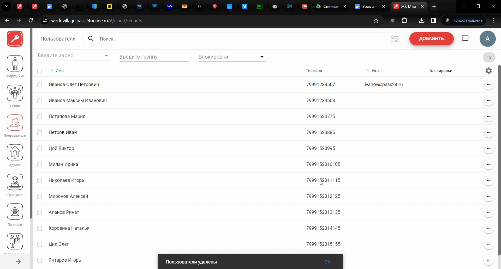
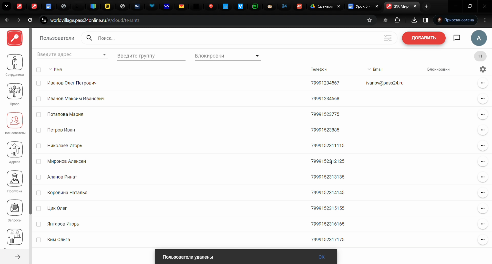
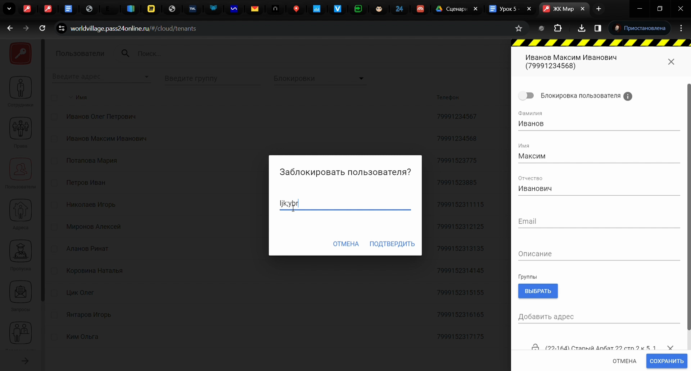

# Модуль Пользователи

## Метаданные документа

| Параметр | Значение |
|----------|----------|
| **Версия** | 1.0 |
| **Дата создания** | 2026-01-22 |
| **Дата последнего обновления** | 2026-01-22 |
| **Автор** | Система автоматической конвертации |
| **Ответственный за актуальность** | Отдел технической поддержки |
| **Статус** | Актуально |
| **Тип документа** | Обучение |
| **Отдел** | Тех. поддержка |
| **Теги** | пользователи, веб-интерфейс, PASS24.online, импорт, блокировка, инструкция |

---

## Целевая аудитория

**Для кого:** Специалисты техподдержки, новые сотрудники, администраторы веб-интерфейса PASS24.online

**Уровень подготовки:** Начинающий

**Когда использовать:** При обучении работе с модулем «Пользователи» в веб-интерфейсе PASS24.online: добавление, импорт, редактирование, удаление, блокировка пользователей

---

## Краткое описание

Данная инструкция описывает работу с модулем **Пользователи** в веб-интерфейсе PASS24.online. В документе приведены пошаговые действия: добавление одного пользователя, импорт пользователей (через раздел «Адреса»), редактирование, удаление одного или нескольких пользователей, блокировка и разблокировка. Учтена рассылка пользователям (модуль «Рассылка»).

---

## Пошаговая инструкция

### Шаг 1: Добавление пользователя

**Что делать:**
1. В **боковом меню** перейдите во **вкладку «Пользователи»**
2. В **правом верхнем углу** нажмите **«Добавить»**
3. Введите **фамилию**, **отчество**, **E-mail**, **номер телефона** пользователя
4. При необходимости добавьте **описание** и **группу**
5. Выберите **адрес**
6. Нажмите **«Сохранить»**

**Где:** Веб-интерфейс PASS24.online, раздел «Пользователи»

**Результат:** Пользователь добавлен

---

### Шаг 2: Импорт пользователей

**Что делать:**
1. В **боковом меню** перейдите во **вкладку «Адреса»**
2. В **правом верхнем углу** нажмите **«Импорт»**
3. Скачайте **образец импорта с пользователями**
4. Заполните файл **в соответствии с образцом** и загрузите его

**Где:** Раздел «Адреса», кнопка «Импорт»

**Результат:** Пользователи импортированы

---

### Шаг 3: Редактирование пользователя

**Что делать:**
1. Нажмите **три точки** справа от пользователя
2. Выберите **«Редактировать»**
3. Внесите необходимые изменения
4. Нажмите **«Сохранить»**

**Где:** Раздел «Пользователи», список пользователей

**Результат:** Данные пользователя обновлены

---

### Шаг 4: Удаление пользователей

**Удаление одного пользователя:**
1. Нажмите **три точки** справа от пользователя
2. Выберите **«Удалить»**
3. Подтвердите удаление

**Удаление нескольких пользователей:**
1. Слева **отметьте чекбоксами** нужных пользователей
2. В **правом верхнем углу** нажмите **корзинку**
3. Подтвердите удаление

**Где:** Раздел «Пользователи», список пользователей

**Результат:** Пользователь(и) удалены

---

### Шаг 5: Блокировка и разблокировка пользователя

**Что делать:**
1. Нажмите **три точки** справа от пользователя
2. Выберите **«Редактировать»**
3. Нажмите **«Блокировать пользователя»**
4. Введите **комментарий блокировки**, подтвердите блокировку
5. Нажмите **«Сохранить»**
6. Для **разблокировки** выполните те же шаги и снимите блокировку

**Где:** Раздел «Пользователи», карточка пользователя

**Результат:** Пользователь заблокирован или разблокирован

---

## Контрольный чек-лист

- [ ] Выполнен переход во вкладку «Пользователи»
- [ ] При добавлении: введены ФИО, email, телефон, выбран адрес, нажато «Сохранить»
- [ ] При импорте: использован образец, файл загружен через раздел «Адреса»
- [ ] При редактировании: открыта форма, внесены изменения, нажато «Сохранить»
- [ ] При удалении: подтверждено удаление (одного или нескольких)
- [ ] При блокировке: указан комментарий, подтверждена блокировка, нажато «Сохранить»

---

## Типичные ошибки и их решение

| Ошибка | Причина | Решение |
|--------|---------|---------|
| Импорт не в «Пользователи» | Импорт пользователей в разделе «Адреса» | Использовать «Адреса» → «Импорт» → образец с пользователями |
| Не сохраняется блокировка | Не указан комментарий | Ввести комментарий блокировки и сохранить |
| Удалил не тех пользователей | Не сняты чекбоксы | Проверить выделение перед нажатием корзинки |

---

## Связанные материалы

- [Модуль Адреса](Модуль%20Адреса.md)
- [Модуль Рассылка](Модуль%20Рассылка.md)
- [Модуль Доверенности](Модуль%20Доверенности.md)
- [Модуль Запросы](Модуль%20Запросы.md)

---

## История изменений

| Версия | Дата | Автор | Изменения |
|--------|------|-------|-----------|
| 1.0 | 2026-01-22 | Система автоматической конвертации | Первоначальная версия на основе видео, приведена к шаблону базы знаний |

---
