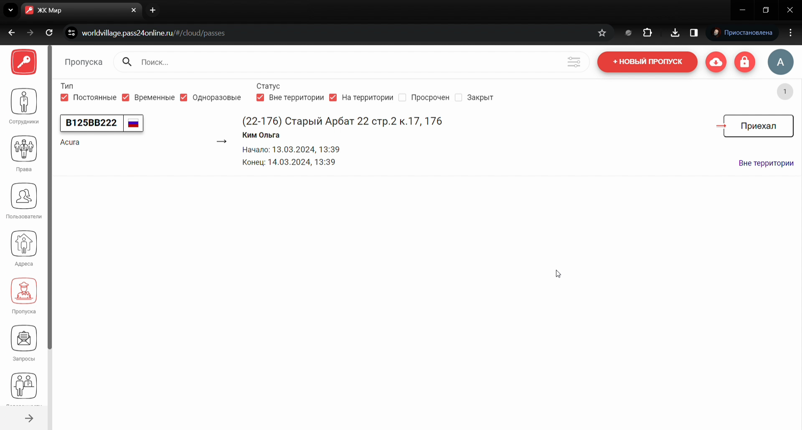
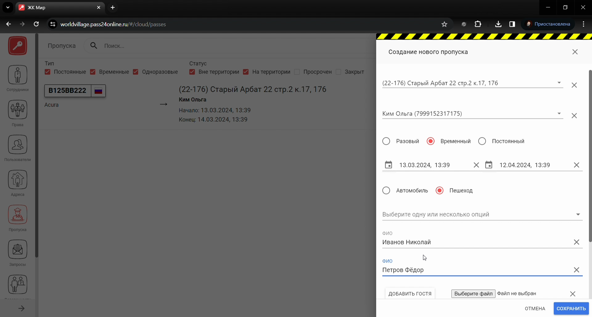
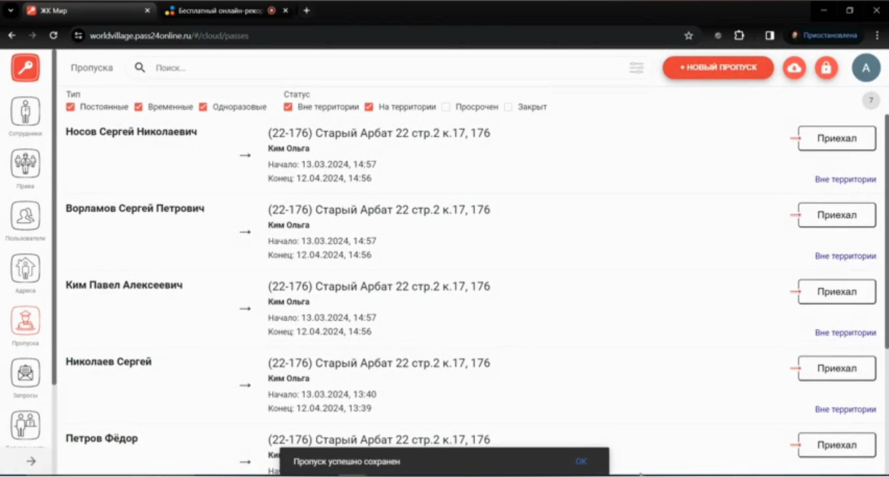
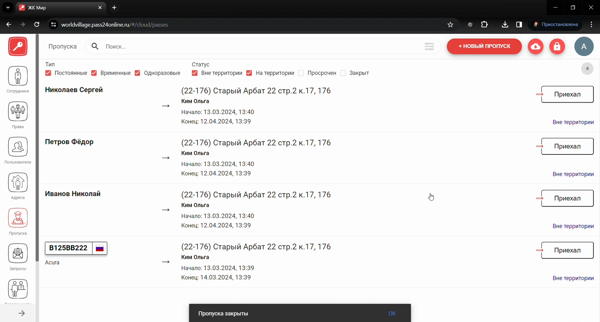
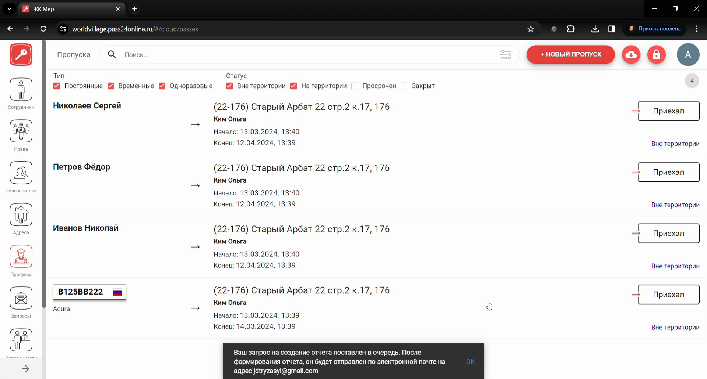
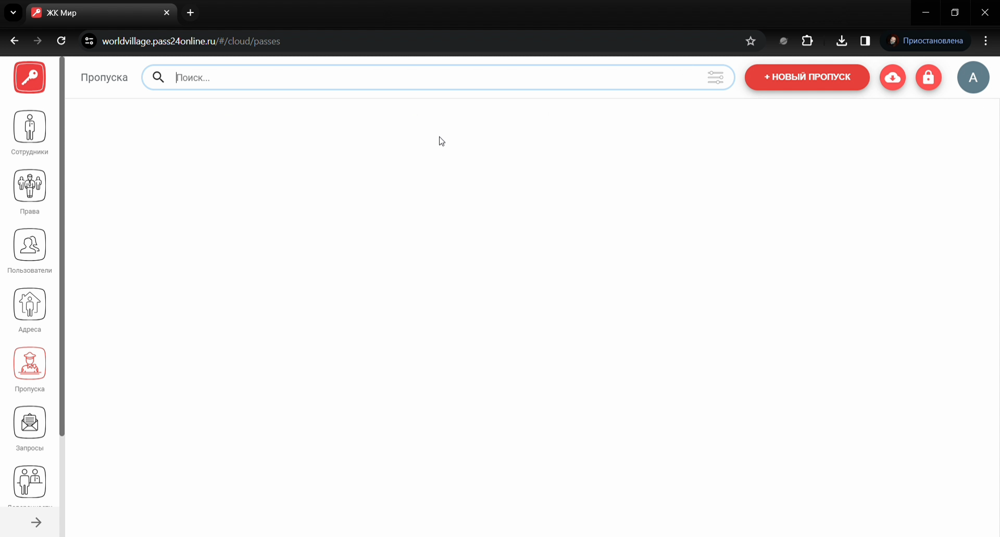
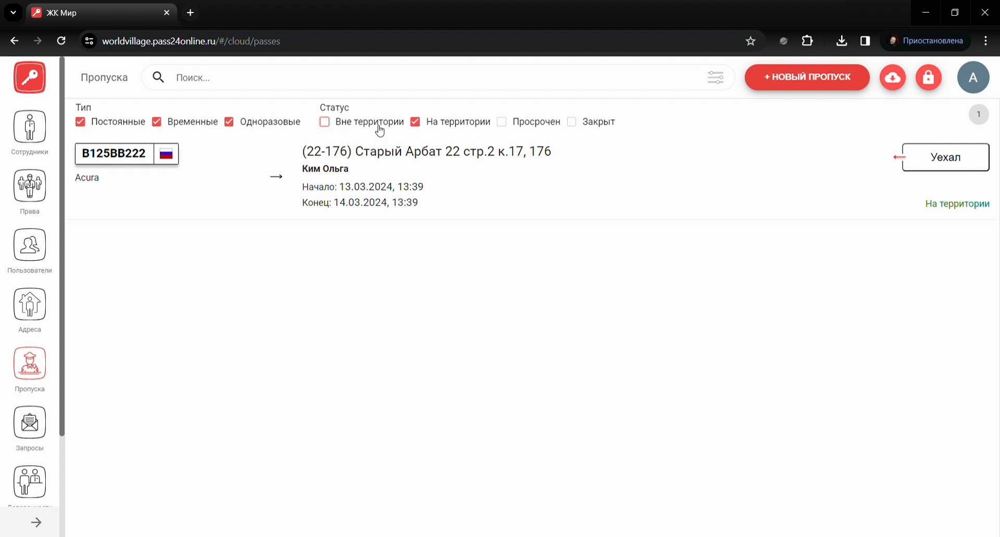
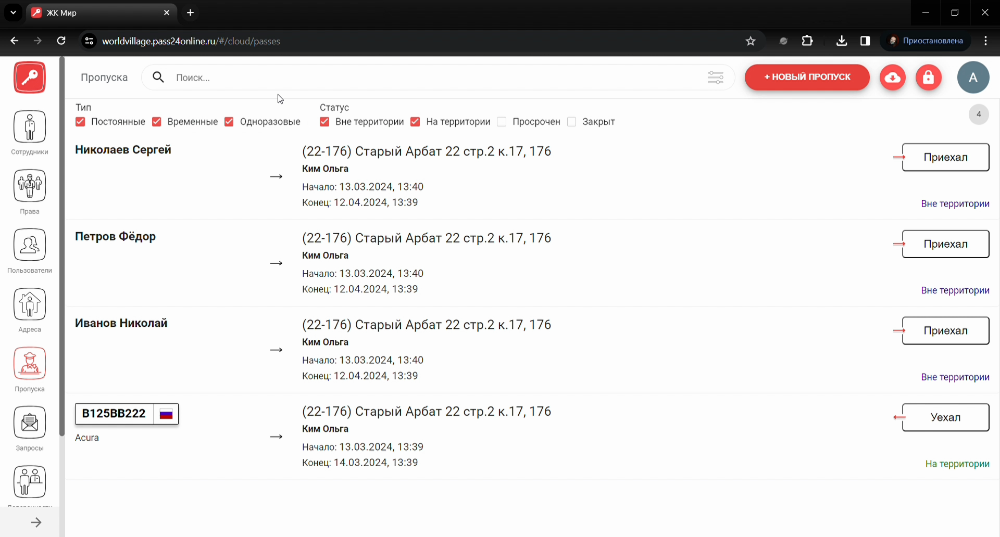

# Модуль Пропуска

## Метаданные документа

| Параметр | Значение |
|----------|----------|
| **Версия** | 1.0 |
| **Дата создания** | 2026-01-22 |
| **Дата последнего обновления** | 2026-01-22 |
| **Автор** | Система автоматической конвертации |
| **Ответственный за актуальность** | Отдел технической поддержки |
| **Статус** | Актуально |
| **Тип документа** | Обучение |
| **Отдел** | Тех. поддержка |
| **Теги** | пропуска, веб-интерфейс, PASS24.online, импорт, закрытие, инструкция |

---

## Целевая аудитория

**Для кого:** Специалисты техподдержки, новые сотрудники, администраторы веб-интерфейса PASS24.online

**Уровень подготовки:** Начинающий

**Когда использовать:** При обучении работе с модулем «Пропуска» в веб-интерфейсе PASS24.online: добавление, импорт, закрытие пропусков, экспорт событий, поиск и фильтрация, работа в реальном времени (приехал/уехал)

---

## Краткое описание

Данная инструкция описывает работу с модулем **Пропуска** в веб-интерфейсе PASS24.online. В документе приведены пошаговые действия: добавление одного или нескольких пропусков, импорт пропусков, закрытие одного или массовое закрытие, экспорт событий для отчётности (отчёт на email, до 31 дня, доступен 24 часа), поиск и фильтрация, отметки «Приехал» / «Уехал» в реальном времени. Учтены особенности разовых, временных и постоянных пропусков.

---

## Пошаговая инструкция

### Шаг 1: Добавление одного пропуска

**Что делать:**
1. В **боковом меню** перейдите во **вкладку «Пропуска»**
2. В **правом верхнем углу** нажмите **«+ Новый пропуск»**
3. Выберите **адрес** и **пользователя**
4. Заполните **тип пропуска** и **время визита**
5. Для **автомобильного** пропуска введите **марку** и **номер автомобиля**
6. Для **пешеходного** — **фамилию**, **имя**, **отчество**
7. Нажмите **«Сохранить»**

**Где:** Веб-интерфейс PASS24.online, раздел «Пропуска»

**Результат:** Пропуск создан

---

### Шаг 2: Добавление нескольких пропусков

**Что делать:**
1. Нажмите **«+ Новый пропуск»**
2. Выберите **адрес** и **пользователя**
3. Выберите **тип пропуска** и **время визита**
4. Для каждого гостя нажмите **«Добавить гостя»** и введите для **автомобильного** — марку и номер автомобиля, для **пешеходного** — фамилию, имя, отчество
5. Нажмите **«Сохранить»**

**Где:** Раздел «Пропуска», форма создания

**Результат:** Несколько пропусков созданы

---

### Шаг 3: Импорт пропусков

**Что делать:**
1. Нажмите **«+ Новый пропуск»**
2. Выберите **адрес** и **пользователя**
3. Выберите **тип пропуска**, **время визита** и **тип гостя**
4. Нажмите **«Выберите файл»**
5. Файл импорта заполняется **в зависимости от типа гостя**: для **автомобильного** — в первом столбце номер автомобиля, для **пешеходного** — фамилия, имя, отчество
6. Выберите файл со списком пропусков и нажмите **«Сохранить»**

**Где:** Раздел «Пропуска», форма создания

**Результат:** Пропуска импортированы

---

### Шаг 4: Закрытие пропуска

**Что делать:**
1. Нажмите на **нужный пропуск** — справа откроется **карточка пропуска**
2. Внизу карточки нажмите на **статус** («На территории» и т.п.) → выберите **«Закрыть»**
3. Если статус **«На территории»** — сначала смените на **«Вне территории»**, затем **«Закрыть»**
4. Если статус **«Просрочен»** — сначала **продлите**, смените статус на **«Вне территории»**, затем **«Закрыть»**

**Где:** Раздел «Пропуска», карточка пропуска справа

**Результат:** Пропуск закрыт

---

### Шаг 5: Массовое закрытие пропусков

**Что делать:**
1. В **правом верхнем углу** нажмите **«Режим массового закрытия»**
2. Слева **отметьте чекбоксами** нужные пропуска
3. В **правом верхнем углу** нажмите **«Закрыть выбранные»**
4. Подтвердите закрытие

**Где:** Раздел «Пропуска», список пропусков

**Результат:** Выбранные пропуска закрыты

---

### Шаг 6: Экспорт событий пропусков

**Что делать:**
1. Выберите **период**
2. При необходимости выберите **пользователя** и **адрес**
3. Нажмите **«Отправить»**
4. Формирование отчёта ставится в очередь; **готовый отчёт** отправляется на **email**, указанный в вашем профиле, и доступен **в течение 24 часов**
5. **Максимальный диапазон дат** для одного отчёта — **31 день**

**Где:** Раздел «Пропуска», экспорт событий

**Результат:** Отчёт сформирован и отправлен на email

---

### Шаг 7: Поиск и фильтрация

**Что делать:**
1. **Поиск:** введите **фамилию**, **имя**, **отчество** пешехода или **номер автомобиля**
2. **Фильтрация по типу пропуска или статусу:** используйте **чекбоксы** в верхней части экрана
3. **Фильтрация по адресу, объекту, типу гостя:** используйте **дополнительный фильтр** поисковой строки
4. **Пример:** чтобы посмотреть, сколько автомобилей на территории — оставьте галочки только на **«На территории»** и в дополнительном фильтре выберите **тип гостя: автомобиль**

**Где:** Раздел «Пропуска», панель поиска и фильтров

**Результат:** Найдены нужные пропуска

---

### Шаг 8: Работа в реальном времени (приехал / уехал)

**Что делать:**
1. Когда гость **приезжает** или **приходит**, найдите его пропуск по **номеру автомобиля** или **фамилии, имени, отчеству** пешехода
2. Нажмите **«Приехал»**
3. Для **выезда** нажмите **«Уехал»**
4. **Разовый пропуск:** после отметки «Уехал» пропуск **закроется**
5. **Временные и постоянные:** статус сменится на **«Вне территории»**

**Где:** Раздел «Пропуска», карточка пропуска / список

**Результат:** Статус пропуска обновлён в реальном времени

---

## Контрольный чек-лист

- [ ] При добавлении: выбран адрес и пользователь, заполнены тип, время, данные гостя(ей), нажато «Сохранить»
- [ ] При импорте: использован файл по образцу (номер авто / ФИО), выбран файл, нажато «Сохранить»
- [ ] При закрытии: при необходимости сменён статус на «Вне территории», выбрано «Закрыть»
- [ ] При массовом закрытии: отмечены чекбоксы, нажато «Закрыть выбранные», подтверждено
- [ ] При экспорте: выбран период (до 31 дня), пользователь/адрес при необходимости, нажато «Отправить»
- [ ] При поиске/фильтрации: использованы поисковая строка, чекбоксы и дополнительный фильтр
- [ ] При работе в реальном времени: отмечены «Приехал» / «Уехал»

---

## Типичные ошибки и их решение

| Ошибка | Причина | Решение |
|--------|---------|---------|
| Нельзя закрыть пропуск | Статус «На территории» или «Просрочен» | Сменить на «Вне территории» (при просрочке — продлить), затем «Закрыть» |
| Импорт не прошёл | Файл не по образцу | Заполнить: для авто — номер в 1-м столбце, для пешехода — ФИО |
| Отчёт не пришёл | Неверный email в профиле | Проверить email в профиле; отчёт доступен 24 часа |
| Не нахожу пропуск | Нет фильтра | Использовать поиск по ФИО/номеру авто, чекбоксы, дополнительный фильтр |

---

## Связанные материалы

- [Модуль Адреса](Модуль%20Адреса.md)
- [Модуль Пользователи](Модуль%20Пользователи.md)
- [Модуль Запросы](Модуль%20Запросы.md)
- [Массовая рассылка пешеходного пропуска](../Массовая%20рассылка/Массовая%20рассылка%20пешеходного%20пропуска.md)

---

## История изменений

| Версия | Дата | Автор | Изменения |
|--------|------|-------|-----------|
| 1.0 | 2026-01-22 | Система автоматической конвертации | Первоначальная версия на основе видео, приведена к шаблону базы знаний |

---
