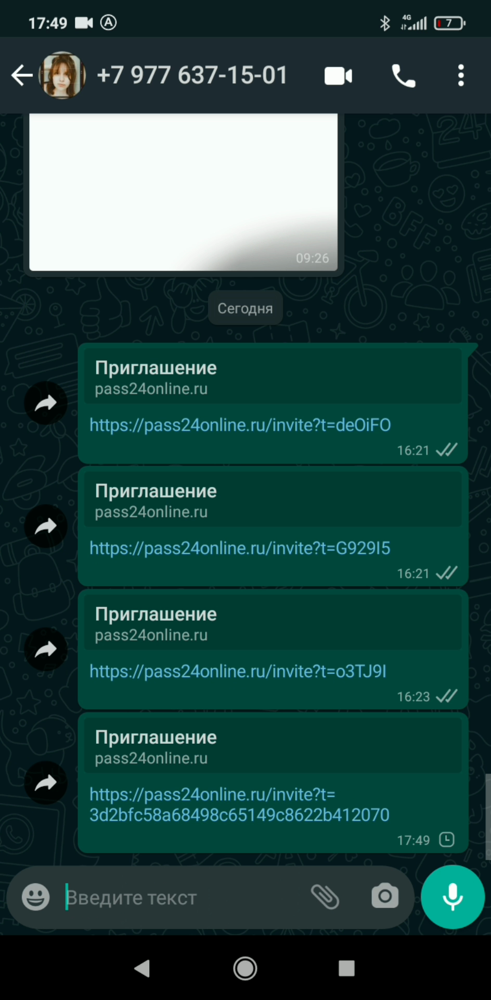
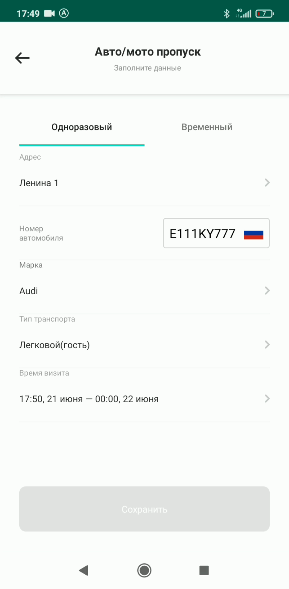
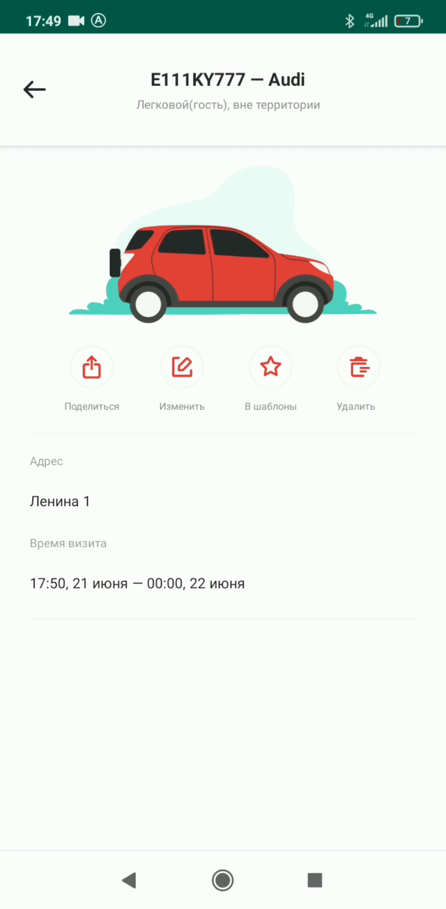
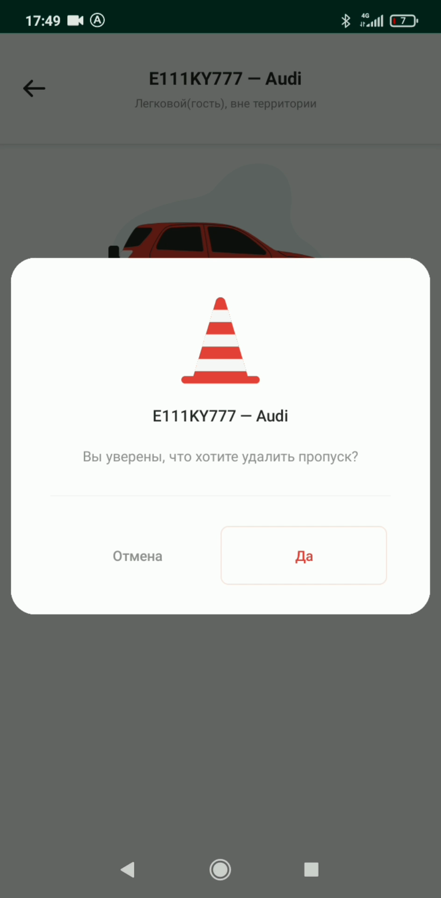

# Работа с разделом "Мои пропуска"

## Метаданные документа

| Параметр | Значение |
|----------|----------|
| **Версия** | 1.0 |
| **Дата создания** | 2026-01-22 |
| **Дата последнего обновления** | 2026-01-22 |
| **Автор** | Система автоматической конвертации |
| **Ответственный за актуальность** | Отдел технической поддержки |
| **Статус** | Актуально |
| **Тип документа** | Обучение |
| **Отдел** | Тех. поддержка |
| **Теги** | пропуски, управление, поиск, шаблоны, мобильное приложение, инструкция |

---

## Целевая аудитория

**Для кого:** Пользователи мобильного приложения PASS24.online, новые сотрудники техподдержки

**Уровень подготовки:** Начинающий

**Когда использовать:** При обучении работе с мобильным приложением PASS24.online, при консультировании пользователей по управлению созданными пропусками

---

## Краткое описание

Данная инструкция описывает функциональность раздела "Мои пропуска" в мобильном приложении PASS24.online. Документ содержит описание всех доступных операций: поиск пропусков, отправка пропусков гостям, редактирование, создание шаблонов и закрытие пропусков.

---

## Основные функции раздела "Мои пропуска"

В данном разделе вы можете выполнить следующие действия:

1. **Найти созданный пропуск** — поиск по списку пропусков
2. **Поделиться пропуском с гостем** — отправка пропуска выбранному гостю
3. **Изменить пропуск** — редактирование данных существующего пропуска
4. **Добавить в шаблон** — сохранение пропуска как шаблона для повторного использования
5. **Закрыть пропуск** — закрытие активного пропуска

---

## Пошаговая инструкция

### Функция 1: Поиск пропуска

**Что делать:**
1. Откройте раздел **"Мои пропуска"**
2. Воспользуйтесь **поисковой строкой** для поиска нужного пропуска
3. Введите ключевые слова (имя гостя, дата, адрес и т.д.)

**Где:** Раздел "Мои пропуска", поисковая строка в верхней части экрана

**Результат:** Отображаются пропуски, соответствующие поисковому запросу

---

### Функция 2: Отправка пропуска гостю

**Что делать:**
1. Найдите нужный пропуск в списке
2. Нажмите на **пропуск** для открытия детальной информации
3. Нажмите кнопку **"Поделиться"**
4. Выберите **гостя**, которому отправляете пропуск, из списка контактов
5. Нажмите кнопку **"Отправить"**

**Где:** Раздел "Мои пропуска", детальная информация о пропуске, кнопка "Поделиться"

**Результат:** Пропуск отправлен выбранному гостю

---

### Функция 3: Редактирование пропуска

**Что делать:**
1. Найдите нужный пропуск в списке
2. Нажмите на **пропуск** для открытия детальной информации
3. Нажмите кнопку **"Изменить"**
4. Внесите необходимые **корректировки** в данные пропуска
5. Нажмите кнопку **"Сохранить"**

**Где:** Раздел "Мои пропуска", детальная информация о пропуске, кнопка "Изменить"

**Результат:** Изменения в пропуске сохранены

---

### Функция 4: Создание шаблона из пропуска

**Что делать:**
1. Найдите нужный пропуск в списке
2. Нажмите на **пропуск** для открытия детальной информации
3. Нажмите кнопку **"В шаблоны"**
4. Введите **имя шаблона**
5. Нажмите кнопку **"Сохранить"**

**Где:** Раздел "Мои пропуска", детальная информация о пропуске, кнопка "В шаблоны"

**Результат:** Пропуск сохранен как шаблон для последующего использования

---

### Функция 5: Закрытие пропуска

**Что делать:**
1. Найдите нужный пропуск в списке
2. Нажмите на **пропуск** для открытия детальной информации
3. Нажмите кнопку **"Закрыть"**
4. **Подтвердите закрытие** пропуска

**Где:** Раздел "Мои пропуска", детальная информация о пропуске, кнопка "Закрыть"

**Результат:** Пропуск закрыт

**Важно:** По истечении 30 дней после закрытия пропуск будет автоматически удален из системы.

---

## Контрольный чек-лист

### Для поиска пропуска:
- [ ] Открыт раздел "Мои пропуска"
- [ ] Использована поисковая строка
- [ ] Найден нужный пропуск

### Для отправки пропуска:
- [ ] Выбран пропуск из списка
- [ ] Нажата кнопка "Поделиться"
- [ ] Выбран получатель из списка контактов
- [ ] Пропуск успешно отправлен

### Для редактирования пропуска:
- [ ] Выбран пропуск из списка
- [ ] Нажата кнопка "Изменить"
- [ ] Внесены необходимые изменения
- [ ] Изменения сохранены

### Для создания шаблона:
- [ ] Выбран пропуск из списка
- [ ] Нажата кнопка "В шаблоны"
- [ ] Введено имя шаблона
- [ ] Шаблон сохранен

### Для закрытия пропуска:
- [ ] Выбран пропуск из списка
- [ ] Нажата кнопка "Закрыть"
- [ ] Закрытие подтверждено
- [ ] Пропуск закрыт

---

## Типичные ошибки и их решение

| Ошибка | Причина | Решение |
|--------|---------|---------|
| Не находится пропуск в поиске | Неверный поисковый запрос | Использовать другие ключевые слова (имя, дата, адрес) |
| Не отображается список контактов при отправке | Контакты не добавлены | Добавить контакты в раздел "Гости" в приложении |
| Нельзя изменить пропуск | Пропуск уже закрыт или истек | Закрытые или истекшие пропуски нельзя редактировать |
| Шаблон не сохраняется | Не введено имя шаблона | Ввести уникальное имя шаблона |

---

## Дополнительная информация

**Важно:**
- Закрытые пропуски автоматически удаляются через 30 дней
- Шаблоны можно использовать для быстрого создания похожих пропусков
- Отправленные пропуски можно отслеживать в разделе "Мои пропуска"

---

## Связанные материалы

- [1. Пропуск для пешехода](1.%20Пропуск%20для%20пешехода.md)
- [2. Пропуск на автомобиль](2.%20Пропуск%20на%20автомобиль.md)
- [3. Приглашение](3.%20Приглашение.md)

---

## История изменений

| Версия | Дата | Автор | Изменения |
|--------|------|-------|-----------|
| 1.0 | 2026-01-22 | Система автоматической конвертации | Первоначальная версия на основе видео |

---
