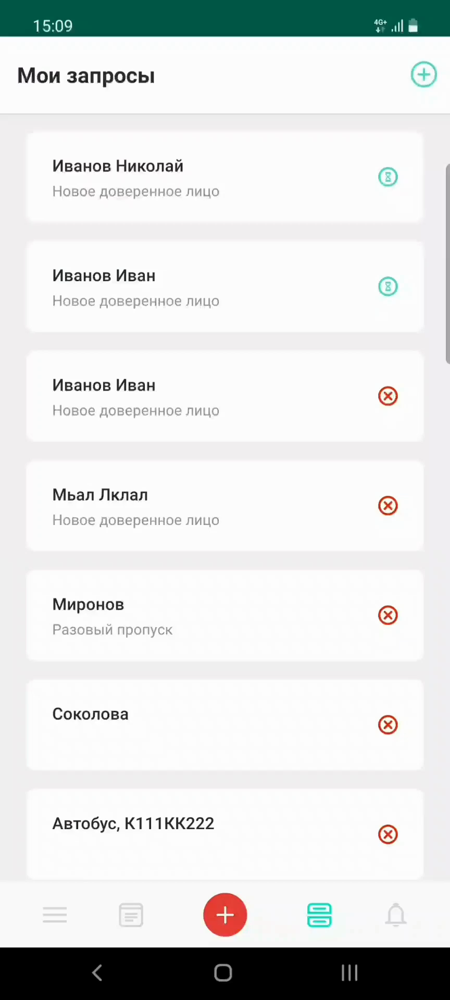
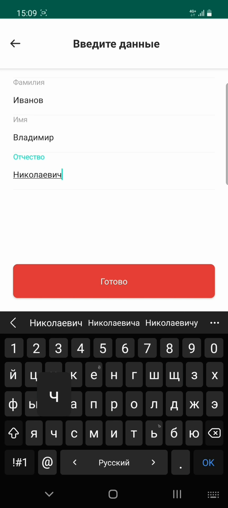
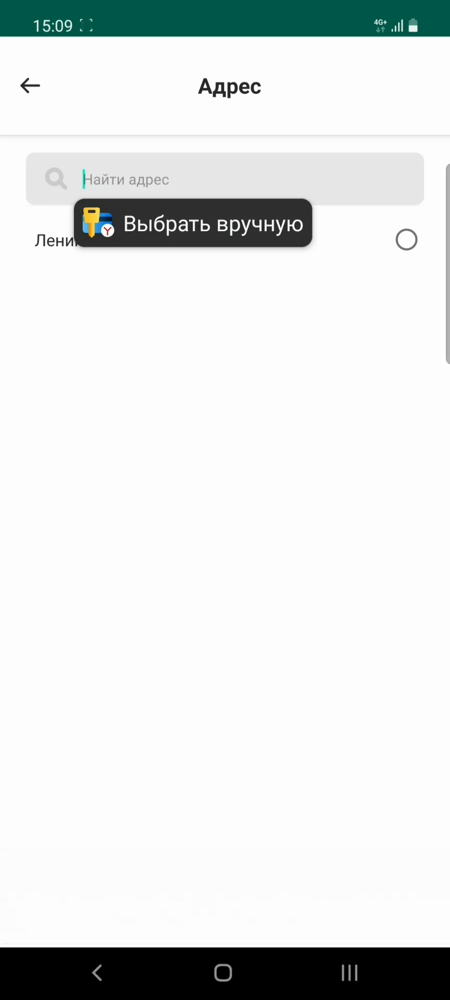
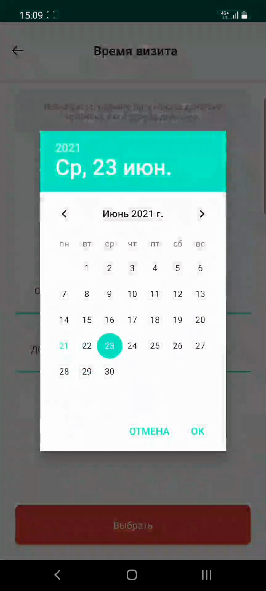

# Запрос на доверенность

## Метаданные документа

| Параметр | Значение |
|----------|----------|
| **Версия** | 1.0 |
| **Дата создания** | 2026-01-22 |
| **Дата последнего обновления** | 2026-01-22 |
| **Автор** | Система автоматической конвертации |
| **Ответственный за актуальность** | Отдел технической поддержки |
| **Статус** | Актуально |
| **Тип документа** | Обучение |
| **Отдел** | Тех. поддержка |
| **Теги** | запрос, доверенность, доверенное лицо, мобильное приложение, инструкция |

---

## Целевая аудитория

**Для кого:** Пользователи мобильного приложения PASS24.online, новые сотрудники техподдержки

**Уровень подготовки:** Начинающий

**Когда использовать:** При обучении работе с мобильным приложением PASS24.online, при консультировании пользователей по созданию запросов на доверенность для доверенных лиц

---

## Краткое описание

Данная инструкция описывает процесс создания запроса на доверенность в мобильном приложении PASS24.online. Документ содержит пошаговое руководство от создания запроса до его отправки, включая заполнение данных о доверенном лице (ФИО, номер телефона), выбор адреса и указание срока действия доверенности.

---

## Пошаговая инструкция

### Шаг 1: Открытие формы создания запроса

**Что делать:**
1. Откройте мобильное приложение PASS24.online
2. Нажмите кнопку **"Плюс"** в правом верхнем углу экрана

**Где:** Главный экран приложения, кнопка "+" в правом верхнем углу

**Результат:** Открывается меню выбора типа запроса

---

### Шаг 2: Выбор типа запроса

**Что делать:**
1. Нажмите на тип запроса **"Доверенное лицо"**

**Где:** Меню выбора типа запроса

**Результат:** Открывается форма создания запроса на доверенность

---

### Шаг 3: Ввод данных доверенного лица

**Что делать:**
1. Введите **фамилию** доверенного лица
2. Введите **имя** доверенного лица
3. Введите **отчество** доверенного лица (при наличии)

**Где:** Форма создания запроса, поля для ввода ФИО

**Результат:** Данные доверенного лица заполнены

---

### Шаг 4: Ввод номера телефона

**Что делать:**
1. Введите **номер телефона** доверенного лица

**Где:** Форма создания запроса, поле "Номер телефона"

**Результат:** Номер телефона указан

---

### Шаг 5: Выбор адреса

**Что делать:**
1. Выберите **адрес** из списка доступных адресов

**Где:** Форма создания запроса, поле "Адрес"

**Результат:** Адрес выбран

---

### Шаг 6: Указание срока действия доверенности

**Что делать:**
1. Укажите **срок действия доверенности** (дату окончания)

**Где:** Форма создания запроса, поле "Срок действия"

**Результат:** Срок действия доверенности указан

---

### Шаг 7: Создание запроса

**Что делать:**
1. Нажмите кнопку **"Создать"**

**Где:** Форма создания запроса, нижняя часть экрана

**Результат:** Запрос успешно отправлен

---

### Шаг 8: Подтверждение отправки

**Что делать:**
1. Дождитесь подтверждения об успешной отправке запроса

**Где:** Экран подтверждения

**Результат:** Отображается сообщение об успешной отправке запроса

**Важно:** Решение по запросу принимает ответственное за взаимодействие с системой лицо. Это может быть, к примеру, арендодатель, администратор или управляющая компания.

---

## Контрольный чек-лист

- [ ] Нажата кнопка "Плюс" в правом верхнем углу
- [ ] Выбран тип запроса "Доверенное лицо"
- [ ] Введена фамилия доверенного лица
- [ ] Введено имя доверенного лица
- [ ] Введено отчество доверенного лица (при наличии)
- [ ] Введен номер телефона доверенного лица
- [ ] Выбран адрес из списка доступных
- [ ] Указан срок действия доверенности
- [ ] Нажата кнопка "Создать"
- [ ] Запрос успешно отправлен
- [ ] Получено подтверждение об отправке

---

## Типичные ошибки и их решение

| Ошибка | Причина | Решение |
|--------|---------|---------|
| Запрос не отправляется | Не заполнены обязательные поля | Проверить заполнение всех обязательных полей (ФИО, телефон, адрес, срок действия) |
| Неверный формат номера телефона | Ошибка ввода | Проверить правильность ввода номера телефона (формат: +7XXXXXXXXXX) |
| Не отображается список адресов | Пользователь не привязан к объекту | Обратиться в управляющую компанию для привязки к объекту |
| Срок действия в прошлом | Выбрана прошедшая дата | Выбрать актуальную или будущую дату |

---

## Дополнительная информация

**Важно:** 
- Решение по запросу на доверенность принимает ответственное за взаимодействие с системой лицо (арендодатель, администратор или управляющая компания)
- После отправки запроса необходимо дождаться решения
- Статус запроса можно отслеживать в разделе "Мои запросы"
- Доверенное лицо получит доступ к управлению пропусками после одобрения запроса

---

## Связанные материалы

- [4. Запрос на постоянный автомобильный пропуск](4.%20Запрос%20на%20постоянный%20автомобильный%20пропуск.md)
- [5. Запрос на постоянный пешеходный пропуск](5.%20Запрос%20на%20постоянный%20пешеходный%20пропуск.md)
- [8. Запрос на новый адрес](8.%20Запрос%20на%20новый%20адрес.md)

---

## История изменений

| Версия | Дата | Автор | Изменения |
|--------|------|-------|-----------|
| 1.0 | 2026-01-22 | Система автоматической конвертации | Первоначальная версия на основе видео |

---
